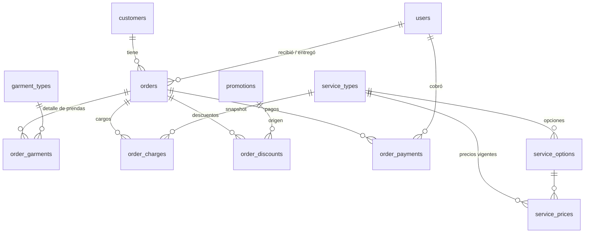

# Plan 0001 — Pedidos diarios (toma de pedido)

| | |
|---|---|
| **Estado** | 📝 Borrador |
| **Fecha** | 2026-07-22 |
| **Módulos afectados** | `customers`, `catalog`, `orders`, `promotions` (+ diseño preliminar de `inventory`) |
| **Depende de** | Módulo `identity` (RBAC) ya implementado. Coordinado con el [Plan 0004 — Offline-first](../0004-sincronizacion-offline/PLAN.md): los modelos nacen con `SyncableMixin` y los services deben ser invocables desde REST y desde el aplicador de ops de sync (ver 0004 §13) |

## 1. Contexto

La lavandería La Valiente (Cobán) registra hoy sus pedidos en una boleta física impresa
(talonario de Corporación Limpio, S.A.). La boleta captura: fecha, peso en libras, número de
serie impreso del talonario, correlativo del pedido en el día, NIT, datos del cliente, detalle
de prendas recibidas (para control de pérdidas y estadística), observaciones, los servicios
cobrados (lavado por peso, lavado por tina, secado, lavado a mano, extras, domicilio), los
descuentos por promoción y el total.

Este plan digitaliza ese flujo como la **etapa 1** del sistema: un módulo interno usado por
**administradores** y **colaboradores** (no hay acceso de clientes finales). El diseño deja
preparado el terreno para las etapas siguientes: cierre diario y venta de inventario por lotes.

## 2. Alcance

**Dentro:**

- Clientes reutilizables con búsqueda (`customers`).
- Catálogo de servicios, tipos de prenda y **precios versionados** (`catalog`).
- Pedidos completos: encabezado, detalle de prendas, cargos, descuentos, pagos y ciclo de
  estados (`orders`).
- Promociones con vigencia (`promotions`).
- Permisos RBAC nuevos sobre el módulo `identity` existente.
- Migraciones Alembic y seeders con los datos actuales de la boleta.

**Fuera (planes futuros):**

- Cierre diario / arqueo de caja (los pedidos quedan consultables por fecha para alimentarlo).
- Implementación de inventario y ventas por lote (aquí solo se deja el diseño de tablas, §12).
- Facturación electrónica ante SAT (solo se registra el NIT).
- Notificaciones al cliente (SMS/WhatsApp de "pedido listo").

## 3. Glosario de dominio

| Término | Significado |
|---|---|
| **Serie de imprenta** (`booklet_serial`) | Número impreso en la boleta física por la imprenta (el `#Tomapedido` del talonario). Van en serie y **no se repiten**. |
| **Correlativo diario** (`daily_number`) | El `No.` de la boleta: número del pedido dentro del día. Ej.: pedido 2 del 22/07/2026. Reinicia cada día. |
| **NIT** | Identificación tributaria del cliente (el campo impreso como "Factura" en la boleta realmente captura el NIT). |
| **No. Piezas** | Total de prendas del pedido. **Debe coincidir** con la suma del detalle de prendas. |
| **Lavado por peso** | Libras × precio por libra (hoy Q2.50/lb). |
| **Lavado por tina** | Según la cantidad de agua de la tina de la lavadora: **G**rande Q30, **E**stándar Q25, **P**equeña Q20. Puede cobrarse más de una tina. |
| **Secado** | Por tiempo, base 40 min a temperatura media, en lapsos de 10 min: **T40** Q20, **T50** Q25, **T60** Q30. |
| **Nivel** (lavado a mano) | Por cantidad de piezas lavadas a mano: **N2** = 1–4 piezas Q5, **N3** = 5–9 Q10, **N4** = 10–13 Q15. |
| **R — Rins** | Se agregó suavizante. Q10 c/u; puede cobrarse N veces en un pedido (ej. 3 Rins). |
| **S — Spin** | Se centrifugó. Q5 c/u; puede cobrarse N veces (ej. 4 Spins). |
| **T10** | Tiempo extra de secado más allá de T60: Q5 por cada lapso de 10 min. |
| **SU — Servicio urgente** | Q10 c/u; también puede ser N, aunque el caso normal es 1. |
| **Recepción / Entrega** | Cobro por domicilio, **monto variable** según lo que cobre el motorista. |
| **Descuentos por promoción** | (1) 50% del cobro por domicilio; (2) Q5 por lavado+secado de edredones o ropa que no va por peso; (3) temporal 15–30 jul 2026: Q35 total por lavado+secado de edredón. |

## 4. Decisiones de diseño

- **D1 — Precios en catálogo versionado, nunca hardcodeados.** Cada precio vive en
  `service_prices` con vigencia (`valid_from` / `valid_to`). Cambiar el precio de la libra no
  toca código ni altera pedidos históricos.
- **D2 — Snapshot de precio en el pedido.** Cada cargo (`order_charges`) guarda descripción,
  precio unitario y monto al momento de crearse. El pedido es un documento inmutable respecto
  del catálogo: si mañana la tina grande sube a Q35, los pedidos de hoy siguen diciendo Q30.
- **D3 — Cargos como líneas genéricas, no columnas fijas.** "2 tinas grandes" es una línea con
  `quantity=2, unit_price=30, amount=60`. Agregar un servicio nuevo (ej. planchado) es un
  registro en catálogo, no una migración de la tabla de pedidos.
- **D3.1 — Toda línea de cargo acepta cantidad N (default 1).** Ningún servicio se modela como
  cobro único: 3 Rins y 4 Spins son dos líneas con `quantity=3` y `quantity=4`; incluso el
  servicio urgente admite N × precio. La app muestra 1 por defecto y deja subir la cantidad.
- **D4 — Doble numeración.** `daily_number` lo genera el sistema por fecha (único por
  `order_date`); `booklet_serial` es el número de la boleta física (único global, opcional
  pensando en el día que se abandone el talonario).
- **D5 — El servidor siempre calcula el total.** El cliente (app Flutter) envía cantidades y
  selecciones; los precios se resuelven del catálogo vigente y los montos se calculan en el
  `service`. Nunca se confía en un total enviado por el cliente.
- **D6 — Dinero como `Numeric(10, 2)`.** Moneda implícita GTQ (quetzales). Nada de `float`.
- **D7 — Tipos de prenda en tabla administrable**, no enum: agregar/desactivar prendas es un
  CRUD de admin, sin migración.
- **D8 — Fecha de negocio en zona horaria `America/Guatemala`.** `order_date` es un `Date`
  local del negocio (define el correlativo diario y el futuro cierre diario); los timestamps de
  auditoría siguen siendo UTC (`DateTime(timezone=True)`), como en `identity`.
- **D9 — Soft-delete para clientes y catálogo** (`is_active`), nunca borrado físico: los
  pedidos históricos los referencian.
- **D10 — RBAC con los permisos `resource.action` existentes.** Se siembran permisos nuevos y
  dos roles: `admin` (todo) y `collaborator` (operación diaria, sin administrar catálogo,
  promociones ni precios).
- **D11 — Concurrencia del correlativo diario** resuelta con constraint único
  `(order_date, daily_number)` + reintento en el repository ante `IntegrityError` (máx. 3
  intentos). El volumen es bajo; no se necesita tabla de contadores.
- **D12 — Los pedidos entregados o anulados son inmutables.** Una corrección posterior se hace
  anulando y recreando, dejando rastro. Antes de eso, la edición depende del estado y del rol
  (ver §7.3).

## 5. Modelo de datos



Todas las tablas usan `id UUID` (PK, `default=uuid4`), `created_at` / `updated_at` con
`server_default=func.now()`, siguiendo el patrón de `identity`.

### 5.1 Módulo `customers`

**`customers`**

| Campo | Tipo | Notas |
|---|---|---|
| `full_name` | `String(120)` | Obligatorio |
| `phone` | `String(32)` \| null | Casi siempre presente; índice |
| `nit` | `String(20)` \| null | NIT por defecto del cliente ("CF" si consumidor final) |
| `email` | `String(320)` \| null | Opcional |
| `address` | `Text` \| null | Opcional |
| `notes` | `Text` \| null | Opcional |
| `is_active` | `Boolean` | Soft-delete |

Índices: `phone`, `lower(full_name)` (búsqueda). Si la búsqueda se queda corta, evaluar
`pg_trgm` después — no en esta etapa.

### 5.2 Módulo `catalog`

**`service_types`** — los servicios cobrables.

| Campo | Tipo | Notas |
|---|---|---|
| `code` | `String(50)` | Único. Ej. `wash_by_weight` |
| `name` | `String(120)` | Nombre visible. Ej. "Lavado por peso" |
| `pricing_mode` | enum `per_unit` \| `tiered` \| `variable` | Ver abajo |
| `unit_label` | `String(30)` \| null | "lb", "tina", "lapso 10 min"… |
| `is_active` | `Boolean` | |
| `sort_order` | `Integer` | Orden en la app |

Modos de precio:

- **`per_unit`**: precio × cantidad — lavado por peso, tiempo extra de secado y todos los
  extras (Rins, Spin, SU). La cantidad default es 1 pero siempre puede ser N (D3.1).
- **`tiered`**: se elige una opción (`service_options`) y el precio es el de la opción ×
  cantidad (tinas, secado, nivel). También admite N (ej. 2 tinas grandes).
- **`variable`**: el monto se digita al capturar (recepción/entrega según el motorista). No
  tiene precio en catálogo.

**`service_options`** — las opciones de los servicios `tiered`.

| Campo | Tipo | Notas |
|---|---|---|
| `service_type_id` | FK → `service_types` | `ondelete=CASCADE` |
| `code` | `String(20)` | Único por servicio: `G`, `E`, `P`, `T40`, `N2`… |
| `name` | `String(120)` | "Tina grande", "Secado 40 min"… |
| `min_quantity` / `max_quantity` | `Integer` \| null | Para nivel: N2 = 1–4 piezas, etc. |
| `is_active`, `sort_order` | | |

**`service_prices`** — historial de precios (D1).

| Campo | Tipo | Notas |
|---|---|---|
| `service_type_id` | FK → `service_types` | |
| `service_option_id` | FK → `service_options` \| null | null para `per_unit` |
| `price` | `Numeric(10, 2)` | |
| `valid_from` | `Date` | |
| `valid_to` | `Date` \| null | null = vigente |

Regla: al registrar un precio nuevo, el service cierra el vigente (`valid_to = valid_from - 1 día`)
en la misma transacción. El precio aplicable a un pedido es el vigente en su `order_date`.

**`garment_types`** — tipos de prenda administrables (D7).

| Campo | Tipo | Notas |
|---|---|---|
| `name` | `String(80)` | Único |
| `is_active`, `sort_order` | | |

### 5.3 Módulo `orders`

**`orders`**

| Campo | Tipo | Notas |
|---|---|---|
| `order_date` | `Date` | Fecha de negocio (D8) |
| `daily_number` | `Integer` | Correlativo del día, generado por el sistema (D4, D11) |
| `booklet_serial` | `String(20)` \| null | Serie de imprenta; único cuando existe |
| `customer_id` | FK → `customers` | Obligatorio (se crea el cliente al vuelo si es nuevo) |
| `nit` | `String(20)` \| null | NIT usado en **este** pedido (puede diferir del default del cliente) |
| `weight_lbs` | `Numeric(6, 2)` \| null | Solo si hay lavado por peso |
| `total_pieces` | `Integer` | **Calculado** = Σ `order_garments.quantity` (ver §6.3) |
| `observations` | `Text` \| null | |
| `status` | enum `received` \| `in_progress` \| `ready` \| `delivered` \| `cancelled` | |
| `subtotal` | `Numeric(10, 2)` | Σ cargos |
| `discount_total` | `Numeric(10, 2)` | Σ descuentos |
| `total` | `Numeric(10, 2)` | `subtotal - discount_total` |
| `received_by_id` | FK → `users` | Quién registró |
| `delivered_at`, `delivered_by_id` | \| null | Se llenan al entregar |
| `cancelled_at`, `cancelled_by_id`, `cancel_reason` | \| null | Se llenan al anular |

Constraints e índices: `UNIQUE(order_date, daily_number)`, `UNIQUE(booklet_serial)` (parcial,
solo no-null), índices en `order_date`, `customer_id`, `status`.

**`order_garments`** — detalle de prendas y control de pérdidas.

| Campo | Tipo | Notas |
|---|---|---|
| `order_id` | FK → `orders` | `ondelete=CASCADE` |
| `garment_type_id` | FK → `garment_types` | `UNIQUE(order_id, garment_type_id)` |
| `quantity` | `Integer` | Recibidas; > 0 |
| `quantity_delivered` | `Integer` \| null | Se llena al entregar; la diferencia es la pérdida |
| `notes` | `Text` \| null | "camisa blanca manchada", etc. |

**`order_charges`** — líneas de cargo con snapshot (D2, D3).

| Campo | Tipo | Notas |
|---|---|---|
| `order_id` | FK → `orders` | `ondelete=CASCADE` |
| `service_type_id` | FK → `service_types` | |
| `service_option_id` | FK → `service_options` \| null | |
| `description` | `String(160)` | Snapshot legible: "Lavado tina grande" |
| `quantity` | `Numeric(8, 2)` | > 0. Libras, número de tinas, lapsos, repeticiones de un extra… default 1 (D3.1) |
| `unit_price` | `Numeric(10, 2)` | Snapshot del catálogo (o monto digitado si `variable`) |
| `amount` | `Numeric(10, 2)` | `quantity × unit_price` |

**`order_discounts`**

| Campo | Tipo | Notas |
|---|---|---|
| `order_id` | FK → `orders` | `ondelete=CASCADE` |
| `promotion_id` | FK → `promotions` \| null | null = descuento manual (solo admin, D10) |
| `description` | `String(160)` | Snapshot: "50% domicilio", "Promo edredón julio" |
| `amount` | `Numeric(10, 2)` | Positivo; se resta del subtotal |

**`order_payments`**

| Campo | Tipo | Notas |
|---|---|---|
| `order_id` | FK → `orders` | `ondelete=CASCADE` |
| `amount` | `Numeric(10, 2)` | > 0 |
| `method` | enum `cash` \| `transfer` | |
| `is_advance` | `Boolean` | Anticipo (raro, pero existe) |
| `reference` | `String(80)` \| null | No. de transferencia |
| `received_by_id` | FK → `users` | |
| `paid_at` | `DateTime(timezone=True)` | |

Saldo del pedido (derivado, no almacenado): `total − Σ payments`.

### 5.4 Módulo `promotions`

**`promotions`**

| Campo | Tipo | Notas |
|---|---|---|
| `code` | `String(50)` | Único |
| `name` | `String(120)` | |
| `description` | `Text` \| null | |
| `discount_type` | enum `percentage` \| `fixed_amount` \| `special_price` | |
| `value` | `Numeric(10, 2)` | 50 (%), 5 (Q), 35 (Q precio final) |
| `applies_to_service_codes` | `ARRAY(String)` \| null | Códigos de servicio sobre los que aplica (null = pedido completo) |
| `valid_from` | `Date` | |
| `valid_to` | `Date` \| null | null = sin fecha de fin |
| `is_active` | `Boolean` | |

Cálculo por tipo (siempre en el service, sobre los cargos del pedido):

- **`percentage`**: `value%` de la suma de los cargos cuyos servicios estén en
  `applies_to_service_codes` (ej. 50% de recepción+entrega).
- **`fixed_amount`**: monto fijo (ej. Q5).
- **`special_price`**: descuento = (suma de los cargos aplicables) − `value`. Ej. promo
  edredón julio: tina G Q30 + secado T60 Q30 = Q60 → descuento Q25 → paga Q35. Si la suma es
  menor al precio especial, el descuento es 0 (nunca negativo).

En esta etapa el colaborador **selecciona** qué promoción aplicar; el sistema valida vigencia y
calcula el monto. Aplicación automática queda para después.

## 6. Motor de cálculo del total

Vive en `orders/service.py` como lógica pura (sin FastAPI), testeable con unit tests.

### 6.1 Entrada

El endpoint recibe cantidades y selecciones, nunca precios (salvo los `variable`):

```json
POST /api/v1/orders
{
  "order_date": "2026-07-22",
  "booklet_serial": "045213",
  "customer_id": "…",                    // o bien "customer": {"full_name": "…", "phone": "…"} para crearlo al vuelo
  "nit": "1234567-8",
  "weight_lbs": 12.5,
  "observations": "Edredón matrimonial azul",
  "garments": [
    {"garment_type_id": "…", "quantity": 8},
    {"garment_type_id": "…", "quantity": 1, "notes": "edredón azul"}
  ],
  "charges": [
    {"service_code": "wash_by_weight", "quantity": 12.5},
    {"service_code": "wash_tub", "option_code": "G", "quantity": 1},
    {"service_code": "dry", "option_code": "T60", "quantity": 1},
    {"service_code": "extra_softener"},               // sin quantity = 1; acepta N (ej. "quantity": 3)
    {"service_code": "delivery", "amount": 15.00}
  ],
  "discounts": [
    {"promotion_code": "domicilio_50"}
  ],
  "advance_payment": {"amount": 20.00, "method": "cash"}   // opcional
}
```

### 6.2 Algoritmo

1. Resolver cada cargo contra el catálogo **vigente a `order_date`**:
   - `per_unit`: `unit_price` = precio vigente; `amount = quantity × unit_price`.
   - `tiered`: `unit_price` = precio vigente de la opción; `amount = quantity × unit_price`.
   - `variable`: `amount` = monto digitado (obligatorio y ≥ 0 para estos servicios; prohibido
     para el resto).
2. `subtotal = Σ amounts`.
3. Resolver descuentos: validar que la promoción esté activa y vigente a `order_date`, calcular
   el monto según §5.4. Descuento manual (sin promoción) exige permiso `orders.manual_discount`.
4. `discount_total = Σ descuentos`, con tope `discount_total ≤ subtotal`.
5. `total = subtotal − discount_total`.
6. Persistir snapshots (descripción, precios, montos) en la transacción del pedido.

### 6.3 Validaciones

- `total_pieces` se **calcula** como Σ `garments.quantity` (la app muestra la suma en vivo; no
  se envía un valor a validar — el papel exigía que coincidieran, el sistema lo garantiza).
- `weight_lbs` es obligatorio si hay cargo `wash_by_weight`, y su valor debe ser la `quantity`
  de ese cargo.
- Para `hand_wash` (nivel), advertir si la cantidad de piezas declarada no cae en el rango de
  la opción (`min_quantity`–`max_quantity`) — advertencia, no bloqueo: el papel lo maneja con
  criterio humano.
- `booklet_serial` único: error claro si se repite ("esta boleta ya fue registrada").
- Al menos un cargo por pedido.

### 6.4 Ejemplo numérico completo (validación del motor)

Pedido: 12.5 lb por peso + edredón (tina G + secado T60) + suavizante + entrega Q15, con promo
50% domicilio, el 20/07/2026:

| Línea | Cálculo | Monto |
|---|---|---|
| Lavado por peso | 12.5 × Q2.50 | Q31.25 |
| Lavado tina grande | 1 × Q30.00 | Q30.00 |
| Secado T60 | 1 × Q30.00 | Q30.00 |
| Rins (suavizante) | 1 × Q10.00 | Q10.00 |
| Entrega (variable) | — | Q15.00 |
| **Subtotal** | | **Q116.25** |
| Descuento 50% domicilio | 50% × Q15.00 | −Q7.50 |
| **Total** | | **Q108.75** |

Mismo pedido el 20/07/2026 pero aplicando además la promo edredón julio (15–30 jul):
descuento adicional = (Q30 + Q30) − Q35 = Q25.00 → total Q83.75.

## 7. Ciclo de vida del pedido

### 7.1 Estados y transiciones

```
received ──→ in_progress ──→ ready ──→ delivered   (final)
    │             │            │
    └─────────────┴────────────┘←─ ready → in_progress (retroceso permitido)
                  ↓
              cancelled   (final; desde received o in_progress)
```

- `received`: pedido registrado, ropa recibida.
- `in_progress`: en lavado/secado.
- `ready`: listo para entrega o recoger.
- `delivered`: entregado; se registran `quantity_delivered` por prenda y el pago final.
- `cancelled`: anulado con motivo obligatorio.

### 7.2 Entrega

`POST /orders/{id}/deliver` recibe opcionalmente las cantidades entregadas por prenda (default:
igual a las recibidas) y opcionalmente el pago final. Reglas:

- Requiere estado `ready`.
- Requiere saldo 0 tras registrar el pago incluido; entregar con saldo pendiente exige el
  permiso `orders.deliver_unpaid` (solo admin — cubre el caso excepcional de fiar).
- Registra `delivered_at`, `delivered_by_id` y las `quantity_delivered`. Diferencias contra lo
  recibido quedan consultables para el reporte de pérdidas.

### 7.3 Reglas de edición (D12)

| Estado | Colaborador | Admin |
|---|---|---|
| `received`, `in_progress` | Editar todo (`PUT`) | Editar todo |
| `ready` | Solo estado y pagos | Editar todo |
| `delivered`, `cancelled` | Nada | Nada (corregir = anular y recrear) |

## 8. API v1

Prefijo `/api/v1`. Paginación estándar `page` / `page_size`, respuesta con `items` + `total`.

### `customers`

| Método y ruta | Permiso | Descripción |
|---|---|---|
| `GET /customers?search=&page=` | `customers.read` | Busca por nombre o teléfono |
| `POST /customers` | `customers.create` | |
| `GET /customers/{id}` | `customers.read` | Incluye resumen de pedidos recientes |
| `PATCH /customers/{id}` | `customers.update` | |
| `DELETE /customers/{id}` | `customers.archive` | Soft-delete (admin) |

### `catalog`

| Método y ruta | Permiso | Descripción |
|---|---|---|
| `GET /catalog/service-types` | `catalog.read` | Con opciones y precio vigente — lo que la app necesita para pintar la boleta |
| `POST /catalog/service-types` / `PATCH …/{id}` | `catalog.manage` | Admin |
| `POST /catalog/service-types/{id}/prices` | `catalog.manage` | Nueva vigencia de precio (cierra la anterior) |
| `GET /catalog/garment-types` | `catalog.read` | |
| `POST /catalog/garment-types` / `PATCH …/{id}` | `catalog.manage` | Admin |

### `orders`

| Método y ruta | Permiso | Descripción |
|---|---|---|
| `POST /orders` | `orders.create` | Payload de §6.1; devuelve el pedido calculado completo |
| `GET /orders?date=&status=&customer_id=&search=&page=` | `orders.read` | `search` cruza cliente, boleta y correlativo |
| `GET /orders/{id}` | `orders.read` | Con prendas, cargos, descuentos, pagos y saldo |
| `PUT /orders/{id}` | `orders.update` | Reemplaza y recalcula, según §7.3 |
| `POST /orders/{id}/status` | `orders.update` | Transición de estado (§7.1) |
| `POST /orders/{id}/deliver` | `orders.deliver` | §7.2 |
| `POST /orders/{id}/cancel` | `orders.cancel` | Motivo obligatorio |
| `POST /orders/{id}/payments` | `orders.collect_payment` | Anticipos y pagos |
| `GET /orders/daily-summary?date=` | `orders.read` | Conteo, subtotales y total del día — semilla del futuro cierre diario |

### `promotions`

| Método y ruta | Permiso | Descripción |
|---|---|---|
| `GET /promotions?active_on=<fecha>` | `promotions.read` | Las aplicables hoy, para la app |
| `POST /promotions` / `PATCH …/{id}` | `promotions.manage` | Admin |

## 9. Permisos RBAC

Se siembran sobre las tablas existentes de `identity` (`permissions`, `roles`,
`role_permissions`):

| Permiso (`resource.action`) | Admin | Colaborador |
|---|---|---|
| `customers.read` / `create` / `update` | ✔ | ✔ |
| `customers.archive` | ✔ | ✖ |
| `catalog.read` | ✔ | ✔ |
| `catalog.manage` | ✔ | ✖ |
| `orders.create` / `read` / `update` | ✔ | ✔ |
| `orders.deliver` / `cancel` / `collect_payment` | ✔ | ✔ |
| `orders.manual_discount` | ✔ | ✖ |
| `orders.deliver_unpaid` | ✔ | ✖ |
| `promotions.read` | ✔ | ✔ |
| `promotions.manage` | ✔ | ✖ |

Roles sembrados: `admin` (is_system) y `collaborator` (is_system).

## 10. Migraciones y seeders

**Migraciones Alembic** (una por PR, ver §11): tablas de cada módulo según §5.

**Seeders** (en `scripts/`, idempotentes — se pueden re-ejecutar sin duplicar):

- `seed_catalog.py`:
  - Servicios y precios vigentes: `wash_by_weight` Q2.50/lb; `wash_tub` G/E/P Q30/25/20;
    `dry` T40/T50/T60 Q20/25/30; `hand_wash` N2/N3/N4 Q5/10/15 (rangos 1–4, 5–9, 10–13);
    `extra_softener` (Rins) Q10 c/u; `extra_spin` (Spin) Q5 c/u; `extra_dry_time` Q5 por
    lapso de 10 min; `urgent_service` (SU) Q10 c/u; `pickup` y `delivery` variables. Todos
    los `per_unit`/`tiered` cobran N × precio (D3.1).
  - Tipos de prenda (los 21 de la boleta): Blusa, Camisa, Camiseta, Chamarra/Poncho/Edredón,
    Cobertor, Chumpa, Falda, Licra, Mixtos, Medias, Pantalón, Pants/Pijama, Playera/Polo,
    Ropa de Niño, Sábana, Sobrefunda, Short, Suéter, Toalla grande, Toalla de manos, Vestido.
- `seed_promotions.py`: `domicilio_50` (percentage 50, aplica a `pickup`+`delivery`, sin fecha
  fin); `edredon_q5` (fixed_amount 5, sin fecha fin); `edredon_jul2026` (special_price 35,
  aplica a `wash_tub`+`dry`, 2026-07-15 → 2026-07-30).
- `seed_permissions.py`: permisos y roles de §9.

## 11. Plan de implementación

Cada fase es un PR integrable, con sus migraciones, tests unitarios (service/pricing) e
integración (Testcontainers), siguiendo el patrón
`models → schemas → repository → service → endpoints` de la arquitectura.

> **Secuencia con el Plan 0004 (offline-first):** PR 1–2 pueden ir en paralelo a las fases
> S1–S2 de sync, pero sus modelos incluyen `SyncableMixin` desde el inicio. PR 3–4 se
> implementan junto con la fase S4: el service de pedidos es único y lo consumen dos
> transportes (endpoint REST y aplicador de ops).

| Fase | Contenido | Depende de |
|---|---|---|
| **PR 1 — `catalog`** | Modelos, migración, seeder, endpoints de lectura y administración. Es la base de todo lo demás. | — |
| **PR 2 — `customers`** | CRUD + búsqueda + soft-delete. | — (paralelo a PR 1) |
| **PR 3 — `orders` núcleo** | Crear/listar/detalle, motor de cálculo (§6), prendas, cargos, descuento manual. El pedido nace y calcula bien. | PR 1, PR 2 |
| **PR 4 — ciclo de vida** | Estados, entrega con conciliación de prendas, anulación, pagos y saldo. | PR 3 |
| **PR 5 — `promotions`** | Modelo, seeder, integración con el motor de descuentos. | PR 3 |
| **PR 6 — permisos y cierre** | Seeder RBAC definitivo, `daily-summary`, revisión de índices, documentación de API. | PR 4, PR 5 |

## 12. Diseño preliminar de inventario (etapa futura — NO se implementa aquí)

> **Actualización 2026-07-27:** el diseño definitivo de inventario (con imagen de
> producto, costo por lote nullable y ventas de insumos) vive en el
> [Plan 0005](../0005-registro-diario-cierre/PLAN.md), que sustituye esta sección.

Se documenta para que nada de la etapa 1 lo estorbe. La lavandería compra productos (cloro,
detergente, suavizante) **por lote** y puede venderlos; el cierre diario consumirá pedidos +
ventas de inventario.

- **`products`**: `name`, `unit` (bote, bolsa, galón), `is_active`.
- **`product_lots`**: `product_id`, `lot_number` (correlativo por producto: cloro lote 1, 2,
  3…), `quantity_received`, `quantity_available`, `unit_cost`, `sale_price`, `received_at`.
- **`inventory_movements`**: `lot_id`, `movement_type` (`purchase_in` \| `sale_out` \|
  `internal_use` \| `adjustment`), `quantity`, `unit_price` (para ventas), `notes`,
  `created_by_id`. El uso interno (suavizante gastado en pedidos) también se registra aquí,
  lo que alimentará el costo real en el cierre diario.

Nada en `orders` referencia inventario todavía; cuando exista, la venta de productos será un
documento propio (no una línea del pedido de lavandería), y ambos alimentarán el cierre diario.

## 13. Preguntas abiertas

1. **Serie de imprenta entre talonarios**: ¿la numeración impresa puede reiniciar en un
   talonario futuro (y repetirse)? Hoy se asume única global (`UNIQUE`). Si puede repetirse,
   el constraint pasaría a `UNIQUE(booklet_serial, año)` o similar.
2. **NIT default**: ¿se registra "CF" cuando el cliente no da NIT, o se deja vacío?
3. **Precios con vigencia futura**: ¿interesa poder programar un precio que entre a regir en
   una fecha futura, o siempre se cambia "desde hoy"? (El modelo lo soporta; es cuestión de UI.)
4. **`extra_dry_time` vs. tiers de secado**: se asume que T10 aplica **después de T60** (más
   allá del tier máximo). Confirmar que nunca se cobra T10 junto con T40/T50 (en vez de subir
   de tier).

## Historial

| Fecha | Cambio |
|---|---|
| 2026-07-22 | Versión inicial a partir de la boleta física y las aclaraciones del negocio (significado de #Tomapedido, No., NIT, extras R/S/T10/SU, política de pagos). |
| 2026-07-22 | D3.1: se explicita que todo cargo (incluidos Rins, Spin y servicio urgente) acepta cantidad N con default 1. |
| 2026-07-22 | Coordinación con el Plan 0004 (offline-first): `SyncableMixin` en los modelos y services compartidos entre REST y el aplicador de ops. |
| 2026-07-27 | §12 sustituido por el diseño definitivo de inventario del Plan 0005; el orden consolidado de migraciones de la fase 1 vive en el Plan 0005 §8. |
| 2026-07-31 | **PR 1 (`catalog`) y PR 2 (`customers`) implementados** (migración `20260731_0002`, seeders `seed_catalog.py` y `seed_permissions.py`). Ajustes respecto a lo escrito acá: (a) se agregó el permiso `sync.devices.manage` —no estaba en §9— porque la revocación de dispositivos del Plan 0004 D11 necesita uno propio; (b) `service_prices` lleva un índice único parcial sobre `(service_type_id, service_option_id) WHERE valid_to IS NULL`, para que la regla "una sola vigencia abierta" la garantice la base y no solo el service. |
| 2026-08-02 | **PR 3 (`orders` núcleo) implementado**: modelos, migración `20260802_0003`, motor de cálculo, `POST/GET /orders` y `GET /orders/{id}`. Desviaciones y precisiones respecto a lo escrito acá: (a) el motor vive en `orders/pricing.py` y no dentro de `service.py` —§6 pedía lógica pura y testeable, y separarla la deja leerse sin la persistencia alrededor—; (b) los descuentos son solo manuales por ahora y `order_discounts.promotion_id` nace **sin** clave foránea, que la agrega el PR 5 junto con la tabla `promotions`; (c) el `advance_payment` de §6.1 no se implementó: los pagos son PR 4, así que no hay tabla `order_payments` todavía; (d) el redondeo se hace **por línea** y luego se suma, para que las líneas impresas cuadren con el subtotal impreso; (e) `orders` lleva tres CHECK (`total = subtotal - discount_total`, `discount_total <= subtotal`, `daily_number > 0`) porque un total que deja de cuadrar con sus partes se descubre meses después, sobre un pedido ya cobrado; (f) la fecha de negocio (D8) se resuelve con un desfase fijo de -6 h en `core/business_time.py` y no con `ZoneInfo`: la base IANA no está instalada en toda máquina que corre el código, y una zona ausente no puede cambiar en silencio a qué día pertenece un pedido. Verificado contra Postgres real: el ejemplo numérico de §6.4 da 116.25 / 7.50 / 108.75. Falta el PR S4 para que `orders` viaje por el feed. |
| 2026-08-02 | **PR 4 (ciclo de vida) implementado**: tabla `order_payments` (migración `20260802_0004`), `POST /orders/{id}/status`, `/deliver`, `/cancel` y `/payments`, saldo derivado y el `advance_payment` de §6.1 que el PR 3 había dejado pendiente. Desviaciones y precisiones respecto a lo escrito acá: (a) el diagrama de §7.1 se leyó como **retroceso de un paso desde cualquier estado abierto** (`ready → in_progress` y `in_progress → received`), no solo el que el texto nombra: marcar un pedido por error pasa en un mostrador y deshacerlo no puede exigir un administrador; (b) `delivered` y `cancelled` **no son alcanzables por `/status`** — cada uno tiene su endpoint porque cada uno necesita datos que ese cuerpo no tiene (conteo de prendas, motivo) y porque `/status` solo pide `orders.update`, que todo colaborador tiene; (c) un pago **no puede exceder el saldo**: el vuelto que se da en el mostrador no es un pago, y registrar Q100 contra un pedido de Q75 metería veinticinco quetzales que nunca se quedaron en la caja; (d) anular **no toca el dinero ya cobrado** —devolverlo es un movimiento de caja propio y borrarlo dejaría el cajón corto sin nada a qué apuntar—, así que el reembolso queda pendiente para cuando exista el módulo de caja; (e) un pedido **entregado sigue aceptando pagos**, que es justo como se salda uno fiado con `orders.deliver_unpaid`; (f) `PUT /orders/{id}` y las reglas de edición de §7.3 **no se implementaron**: la fila `ready` de esa tabla distingue colaborador de admin y §9 no define ningún permiso que exprese esa diferencia — inventarlo es una decisión del plan, no de la implementación, y le corresponde al PR 6 ("seeder RBAC definitivo"). Verificado contra Postgres real con 34 comprobaciones: cadena de estados, retroceso, entrega con prenda faltante anotada, fiado, anulación y saldo en la lista. |
