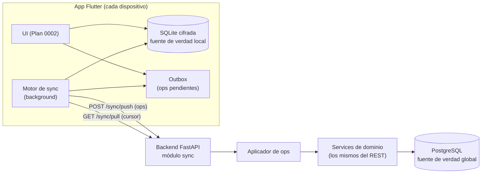

# Plan 0004 — Offline-first y sincronización

| | |
|---|---|
| **Estado** | 📝 Borrador |
| **Fecha** | 2026-07-22 |
| **Módulos afectados** | Backend: `sync` (nuevo) + columnas en toda entidad sincronizable. APP: base de datos local, outbox y motor de sync |
| **Depende de** | `identity` (RBAC). **Precede** a la implementación de pedidos del [Plan 0001](../0001-pedidos-diarios/PLAN.md) (ver §13) |
| **Carácter** | Fundacional — toda entidad futura nace sincronizable |

## 1. Contexto

La operación no puede detenerse cuando se cae el internet: la toma de pedido, el cobro y la
entrega deben funcionar **siempre**, y sincronizarse solas al volver la conexión. Este plan
define la arquitectura offline-first del sistema completo: la app deja de hablar con la API en
el camino crítico y pasa a leer/escribir **su base de datos local**, con un motor de
sincronización detrás.

Escala real del negocio: pocos dispositivos (1–5), decenas de pedidos al día, un solo local.
El diseño debe ser riguroso donde importa (idempotencia, conflictos, dinero, unicidad) y
austero donde no (no necesitamos CRDTs ni streaming en tiempo real — ver §4.1).

## 2. Alcance

**Dentro:** protocolo de sincronización push/pull, columnas y tablas de soporte en el backend,
aplicador de operaciones que reutiliza los services de dominio, base local (SQLite) + outbox +
motor de sync en Flutter, taxonomía de conflictos y cola de revisión, seguridad offline
(sesión, cifrado, dispositivos), estrategia de pruebas multi-dispositivo, y la re-secuenciación
de los planes 0001–0003.

**Fuera:** colaboración en tiempo real (dos personas editando el mismo pedido en vivo),
sincronización peer-to-peer entre dispositivos, y el modo offline del escaneo IA (el Plan 0003
es online-only por naturaleza; con mala señal se captura manual).

## 3. Glosario

| Término | Significado |
|---|---|
| **Fuente de verdad local** | La BD SQLite del dispositivo. La UI **solo** lee/escribe ahí; nunca espera a la red. |
| **Fuente de verdad global** | PostgreSQL en el servidor. Gana todo conflicto salvo regla explícita en contra. |
| **Operación (op)** | Mutación de negocio registrada localmente: `create_order`, `add_payment`… Con `op_id` UUID propio. |
| **Outbox** | Cola local append-only de operaciones pendientes de push, en el orden en que ocurrieron. |
| **Cursor** | Posición del dispositivo en el feed de cambios del servidor (`sync_seq` global). |
| **Tombstone** | Registro marcado como eliminado (`deleted_at`) que sigue viajando en el pull para que los dispositivos lo borren/oculten. |
| **Cola de revisión** | Bandeja en la app con las operaciones que el servidor rechazó y requieren decisión humana. |

## 4. Decisiones de diseño

- **D1 — Offline-first real, no "modo offline".** La app funciona igual con o sin red: la UI
  opera contra SQLite local siempre. "Online" solo significa que el motor de sync está
  vaciando el outbox y trayendo cambios. No existe un camino de código "con conexión" distinto.
- **D2 — El servidor es la autoridad.** Toda op pasa por los **mismos services de dominio**
  que la API REST (motor de precios, validaciones, RBAC). La sincronización no es un bypass:
  es otro transporte hacia la misma lógica. Consecuencia estructural: los services del Plan
  0001 deben ser invocables desde el endpoint REST **y** desde el aplicador de ops.
- **D3 — IDs generados por el cliente (UUID v4).** Ya es la convención del esquema. Permite
  crear entidades offline y referenciarlas entre sí (pedido → cliente nuevo) sin esperar al
  servidor.
- **D4 — Idempotencia absoluta por `op_id`.** Cada op se aplica exactamente una vez: el
  servidor guarda el resultado en `sync_operations` (único por `op_id`) y ante un reintento
  devuelve el resultado registrado. Un crash a media sincronización nunca duplica un pedido ni
  un pago.
- **D5 — Push de comandos, pull de estado.** Suben **operaciones de negocio** (intención);
  baja **estado materializado** (filas con versión). Esto deja al servidor validar invariantes
  (correlativo diario, serie única, transiciones de estado) que un merge de filas jamás podría
  garantizar.
- **D6 — Concurrencia optimista por versión.** Toda entidad sincronizable lleva `version`
  (int incremental). Las ops de update llevan `base_version`; si no coincide con la actual →
  conflicto → cola de revisión. No hay merge automático de campos en entidades de dinero.
- **D7 — Feed de cambios por secuencia global.** Toda escritura toca `sync_seq` (secuencia
  global de PostgreSQL). El pull es `WHERE sync_seq > :cursor ORDER BY sync_seq` paginado —
  simple, ordenado, sin relojes distribuidos.
- **D8 — Borrado = tombstone.** Nunca `DELETE` físico en entidades sincronizables (ya era
  D9 del Plan 0001); `deleted_at` viaja en el pull.
- **D9 — El correlativo diario lo asigna el servidor al sincronizar.** Dos dispositivos
  offline no pueden repartirse el "No." del día sin coordinarse. Offline, el pedido muestra un
  folio provisional local (`P-3`); al sincronizar recibe su `daily_number` definitivo. El
  ancla operativa con el papel siempre es la serie de imprenta (`booklet_serial`).
- **D10 — Los montos se recalculan al aplicar.** La app calcula totales con su catálogo
  cacheado (preview); el servidor recalcula con el catálogo vigente a `order_date` al aplicar
  la op (D5 del Plan 0001 sobrevive al offline). Si difieren, la respuesta trae las cifras
  definitivas y la app actualiza su copia local.
- **D11 — Dispositivos registrados y revocables.** Cada instalación se registra
  (`sync_devices`); un admin puede revocar un dispositivo (robo/baja) y en su siguiente
  contacto el servidor ordena el borrado de datos locales.
- **D12 — BD local cifrada.** SQLCipher (vía drift), llave en Keystore/Keychain. La boleta
  contiene datos personales; un teléfono perdido no puede regalarlos.

### 4.1 Alternativas consideradas y descartadas

| Alternativa | Por qué no |
|---|---|
| CRDTs / merge automático (Automerge, etc.) | Los invariantes que importan aquí (correlativo, serie única, totales, transiciones) son reglas de negocio centralizadas; un CRDT converge pero no valida. Complejidad enorme para 1–5 dispositivos. |
| Plataformas de sync de terceros (PowerSync, ElectricSQL, Firebase) | Dependencia externa y de pago para un problema acotado; además el requisito D2 (ops por los services propios) es incompatible con replicar filas directo. |
| LWW por campo (last-write-wins) | Peligroso con dinero: perder silenciosamente un cargo o un pago es inaceptable. Preferimos rechazar y que un humano decida (§8). |
| WebSocket / tiempo real | El pull por lotes al reconectar y periódico cubre el caso de uso; el local es uno solo. Se puede añadir después sin cambiar el protocolo. |
| Relojes híbridos (HLC) | Con servidor autoritativo y `sync_seq` global no hay ordenamiento distribuido que resolver. El `seq` local por dispositivo ordena el outbox; el servidor ordena el mundo. |

## 5. Arquitectura



Ciclo del motor: **push → pull → reconciliar**. Disparadores: recuperar conectividad, app a
foreground, mutación local (debounced), y periódico. Reintentos con backoff exponencial +
jitter; nunca dos ciclos concurrentes.

## 6. Modelo de datos

### 6.1 Servidor — columnas en toda entidad sincronizable (`SyncableMixin`)

| Columna | Tipo | Notas |
|---|---|---|
| `version` | `Integer`, default 1 | Incrementa en cada escritura (D6) |
| `sync_seq` | `BigInteger`, índice | Asignado de la secuencia global en cada escritura (D7) |
| `deleted_at` | `DateTime` \| null | Tombstone (D8) |

Aplica a: `customers`, `garment_types`, `service_types`, `service_options`, `service_prices`,
`promotions`, `orders`, `order_garments`, `order_charges`, `order_discounts`,
`order_payments`. (Las tablas hijas de pedido viajan embebidas en su pedido en el pull, pero
llevan las columnas para el feed.) `identity` no se sincroniza: la gestión de usuarios es
online-only; la app cachea lo mínimo (§10).

> **Actualización 2026-07-27:** el [Plan 0005](../0005-registro-diario-cierre/PLAN.md)
> §6.4 extiende esta lista con sus entidades (`staff`, `inventory`, `expenses`,
> `daily_close`) y agrega conflictos nuevos a la tabla de §8.

### 6.2 Servidor — tablas nuevas (módulo `sync`)

**`sync_devices`**

| Campo | Tipo | Notas |
|---|---|---|
| `id` | UUID PK | Generado por el dispositivo en el primer login |
| `user_id` | FK → `users` | Último usuario que lo usó |
| `name` | `String(80)` | "Tablet mostrador" |
| `platform`, `app_version` | `String` | Diagnóstico |
| `last_seen_at`, `last_push_at`, `last_pull_cursor` | | Observabilidad |
| `revoked_at` | `DateTime` \| null | D11: al contactar, recibe orden de wipe |

**`sync_operations`** — bitácora idempotente (D4)

| Campo | Tipo | Notas |
|---|---|---|
| `op_id` | UUID, **único** | Idempotencia |
| `device_id` | FK → `sync_devices` | |
| `user_id` | FK → `users` | Quién la originó (RBAC se evalúa con este usuario) |
| `entity`, `op_type`, `entity_id` | `String` / UUID | `order` + `create`, etc. |
| `payload` | `JSONB` | El comando tal como llegó |
| `status` | enum `applied` \| `already_applied` \| `rejected` \| `conflict` | |
| `result` | `JSONB` | Lo que se respondió (se re-sirve ante replay) |
| `reason` | `Text` \| null | Si rechazada/conflicto |
| `client_ts`, `applied_at` | | Skew de reloj se loguea si excede umbral |

### 6.3 Cliente (drift/SQLite)

- **Espejo de las entidades sincronizables** + metadatos por fila: `version` conocida,
  `pending` (tiene cambios locales sin confirmar), `sync_status`
  (`synced` \| `pending` \| `rejected`).
- **`outbox`**: `op_id`, `seq` local monotónico, `entity`, `op_type`, `entity_id`, `payload`,
  `created_at`, `attempts`, `last_error`.
- **`sync_state`**: cursor de pull, timestamps del último ciclo, `device_id`.
- **`review_queue`**: ops rechazadas/en conflicto con su razón y el estado servidor adjunto.

## 7. Protocolo

### 7.1 Push — `POST /api/v1/sync/push`

```jsonc
{
  "device_id": "…",
  "operations": [
    {
      "op_id": "1f0c…",             // UUID nuevo por op — clave de idempotencia
      "seq": 41,                     // orden local del dispositivo (se aplican en orden)
      "entity": "order",
      "op_type": "create",           // create | update | change_status | deliver | cancel | add_payment …
      "entity_id": "9a2b…",          // UUID generado por el cliente (D3)
      "base_version": null,          // requerido en updates (D6)
      "payload": { /* mismo contrato que el endpoint REST equivalente (Plan 0001 §6.1) */ },
      "client_ts": "2026-07-22T14:03:22-06:00"
    }
  ]
}
```

Respuesta — un resultado por op, en orden:

```jsonc
{
  "results": [
    {
      "op_id": "1f0c…",
      "status": "applied",           // applied | already_applied | rejected | conflict
      "entity_id": "9a2b…",
      "server_version": 1,
      "server_data": { "daily_number": 7, "subtotal": "116.25", "total": "108.75" },
      "warnings": [],
      "reason": null                  // en rejected/conflict: motivo legible + estado actual
    }
  ]
}
```

Reglas: lote máx. 200 ops; cada op se aplica en su **propia transacción** (una op mala no
tumba el lote); las ops de un dispositivo se aplican en orden de `seq`; permisos RBAC se
evalúan con el `user_id` de la op — un permiso retirado entre la captura offline y el sync
produce `rejected` (a revisión, §8).

### 7.2 Pull — `GET /api/v1/sync/pull?cursor=184023&page_size=500`

```jsonc
{
  "changes": [
    { "entity": "customer", "id": "…", "version": 7, "sync_seq": 184031,
      "deleted": false, "data": { /* fila completa */ } },
    { "entity": "order", "id": "…", "version": 3, "sync_seq": 184102,
      "deleted": false, "data": { /* pedido con prendas, cargos, descuentos, pagos */ } }
  ],
  "next_cursor": 184530,
  "has_more": false,
  "server_time": "2026-07-22T20:10:00Z",
  "device_directive": null            // "wipe" si el dispositivo fue revocado (D11)
}
```

Reglas: orden estricto por `sync_seq`; el cliente aplica la página y **luego** persiste el
cursor (crash-safe: re-aplicar una página es inocuo porque el upsert es por `id` + `version`);
una fila local con `pending` no se pisa con el pull — se resuelve cuando su op se confirme o
caiga a revisión.

**Bootstrap** (primer arranque o post-wipe): pull desde `cursor=0` pagina el snapshot completo
(catálogo primero, luego clientes, luego pedidos de los últimos N días — configurable). El
dispositivo queda operable offline desde ese momento.

### 7.3 Qué sincroniza cada entidad

| Entidad | Dirección | Ops offline permitidas |
|---|---|---|
| Catálogo (servicios, opciones, precios, prendas) | Servidor → app | Ninguna (admin edita online) |
| Promociones | Servidor → app | Ninguna |
| Clientes | Bidireccional | `create`, `update` |
| Pedidos (+ hijas) | Bidireccional | `create`, `update`, `change_status`, `deliver`, `cancel` |
| Pagos | App → servidor (append-only) | `add_payment` |
| Usuarios/roles | No sincroniza | — (online-only) |
| Escaneos (Plan 0003) | No sincroniza | — (requiere red por definición) |

## 8. Conflictos: taxonomía y resolución

Principio: **nada de dinero se fusiona en silencio**. Lo automático se limita a lo seguro; el
resto va a la cola de revisión con contexto completo.

| Caso | Detección | Resolución |
|---|---|---|
| Mismo `booklet_serial` desde dos dispositivos | Unique en servidor | 2ª op → `rejected` ("boleta ya registrada, pedido X"). Casi siempre es doble captura: la app ofrece descartar el duplicado o editar la serie |
| Dos pedidos offline el mismo día | — | No es conflicto: el servidor asigna `daily_number` por orden de llegada (D9) |
| Update con `base_version` vieja | D6 | `conflict`: la app muestra ambas versiones lado a lado; la persona decide qué conservar y re-emite la op |
| Cliente duplicado (dos altas offline de la misma persona) | Teléfono exacto al aplicar `create` | Se aplica **con warning** `possible_duplicate_of`; queda en revisión para fusión manual (endpoint de merge: plan futuro) |
| Transición de estado inválida (ej. entregar un pedido ya anulado desde otro dispositivo) | Service de dominio | `rejected` con estado actual; a revisión |
| Pago duplicado por reintento | `op_id` | Imposible por D4 (`already_applied`) |
| Entrega offline con saldo pendiente según el servidor | Service (`orders.deliver_unpaid`) | Si el usuario no tiene el permiso → `rejected` a revisión; el pedido queda entregado físicamente pero el sistema exige regularizar el cobro |
| Promoción vencida al momento de aplicar | Motor de descuentos | `rejected` con recálculo sugerido sin la promo; la persona confirma |

La **cola de revisión** es una pantalla de la app (badge con contador): cada entrada muestra
qué pasó, el estado local vs. el del servidor, y acciones concretas (reintentar corregido,
descartar, pedir a un admin). Nada desaparece solo.

## 9. Reglas de dominio bajo offline

- **Folio provisional:** hasta sincronizar, el pedido muestra `P-<n>` del dispositivo y un
  ícono de estado. El ticket/confirmación usa la serie de imprenta como referencia ante el
  cliente.
- **Catálogo cacheado:** los precios que ve la app son los del último pull. D10 garantiza que
  el servidor tiene la última palabra; si el recálculo difiere del preview, la app actualiza y
  lo señala.
- **`order_date`:** la pone el dispositivo (fecha de negocio local). Si el skew de reloj
  contra `server_time` supera el umbral, el motor lo reporta y la app avisa al usuario que
  revise la fecha/hora del equipo.
- **Búsqueda de clientes:** contra la BD local (completa tras bootstrap). Un cliente creado en
  otro dispositivo aparece tras el siguiente pull.

## 10. Seguridad offline

- **Sesión con gracia offline:** el refresh token existente (`identity`) mantiene la sesión;
  sin red, la app permite operar con la sesión cacheada hasta `OFFLINE_GRACE_DAYS` (default 7)
  desde la última autenticación exitosa; vencida la gracia, bloquea la captura hasta
  reconectar (los datos locales no se pierden).
- **Cifrado local** (D12): SQLCipher, llave por dispositivo en almacenamiento seguro del SO.
- **Revocación** (D11): admin marca el dispositivo; el siguiente push/pull devuelve
  `device_directive: "wipe"` → la app borra BD local y llaves. Ops pendientes de un
  dispositivo revocado se rechazan.
- **RBAC en el servidor siempre** (§7.1): el permiso se evalúa al aplicar, no al capturar.

## 11. Observabilidad y límites

- Métricas mínimas: ops pendientes por dispositivo y su antigüedad (la señal de "algo no está
  sincronizando"), tasa de rechazo/conflicto por tipo, latencia de push/pull, dispositivos sin
  contacto > 48 h. Primera versión: consultas SQL sobre `sync_operations`/`sync_devices`;
  dashboard después.
- Límites: lote de push 200 ops, página de pull 500 cambios, payload máx. configurable.
- Logging estructurado por ciclo de sync (device, ops, resultados, duración) con
  `core/logging.py`.

## 12. Estrategia de pruebas

- **Servidor:** unit del aplicador (idempotencia, orden, base_version) con fixtures;
  integración con Testcontainers: replay de lotes, op malformada dentro de lote válido, revoke.
- **App:** tests del motor con servidor fake — crash a media página de pull, crash post-push
  pre-ack (el replay debe devolver `already_applied`), outbox con 500 ops.
- **Escenarios dorados multi-dispositivo** (integración end-to-end, dos clientes simulados
  contra el backend real; son la especificación ejecutable del sistema):
  1. A y B capturan pedidos offline el mismo día → sincronizan → correlativos distintos y
     estables.
  2. A y B capturan la **misma boleta física** → el segundo cae a revisión como duplicado.
  3. A edita un pedido que B ya modificó → conflicto por versión → resolución manual.
  4. Crash de red a media sincronización → reintento → cero duplicados (pagos incluidos).
  5. Cambio de precio en catálogo mientras A está offline → el pedido de A se recalcula al
     aplicar y la app refleja las cifras del servidor.
  6. Dispositivo revocado con ops pendientes → wipe y rechazo de sus ops.
  7. Dispositivo 30 días offline → bootstrap parcial + drenado de outbox por lotes sin timeout.

## 13. Plan de implementación y re-secuenciación

| Fase | Contenido | Depende de |
|---|---|---|
| **PR S1 — núcleo servidor** | `SyncableMixin` (version, sync_seq, deleted_at) + secuencia global, tablas `sync_devices`/`sync_operations`, endpoints push/pull, registro de aplicadores por entidad, registro/revocación de dispositivos | — |
| **PR S2 — núcleo app** | drift + SQLCipher, esquema espejo base, outbox, motor de sync (ciclo, backoff, disparadores), bootstrap, indicadores de estado en UI | S1 |
| **PR S3 — primeras entidades** | Catálogo/prendas/promos (pull-only) y clientes (bidireccional) end-to-end; es la prueba de fuego del framework con datos reales | S1, S2 + PR 1–2 del Plan 0001 |
| **PR S4 — pedidos sync-aware** | Aplicadores de `orders` (se construyen **junto con** los PR 3–4 del Plan 0001: mismo service, dos transportes) | S3 |
| **PR S5 — conflictos y revisión** | Cola de revisión en app, flujo de duplicados de cliente/boleta, folio provisional | S4 |
| **PR S6 — calidad** | Suite de escenarios dorados (§12), métricas, límites | S4 |

**Re-secuenciación de los demás planes** (esto es lo que cambia por ser fundacional):

- **Plan 0001:** PR 1–2 (`catalog`, `customers`) pueden ir en paralelo a S1–S2, pero sus
  modelos nacen con `SyncableMixin`. Los PR 3–4 (`orders`) se implementan junto con S4: el
  service es único y lo consumen REST y el aplicador (D2).
- **Plan 0002:** la pantalla lee y escribe la BD local desde el día uno (su pregunta abierta
  #1 queda resuelta por este plan). El "total oficial del server" llega vía sync, no vía
  respuesta HTTP inmediata, cuando se está offline.
- **Plan 0003:** online-only. Sin red, el botón de escaneo se deshabilita con aviso y la
  captura manual offline sigue intacta. Encolar la foto para escaneo diferido queda como
  mejora futura de ese plan.

## 14. Settings nuevos

| Setting | Default | Notas |
|---|---|---|
| `SYNC_PUSH_MAX_OPS` | `200` | |
| `SYNC_PULL_PAGE_SIZE` | `500` | |
| `SYNC_BOOTSTRAP_ORDER_DAYS` | `90` | Pedidos históricos que baja un dispositivo nuevo |
| `SYNC_CLOCK_SKEW_WARN_S` | `300` | Umbral de aviso de reloj |
| `OFFLINE_GRACE_DAYS` | `7` | §10 |

## 15. Preguntas abiertas

1. ¿PIN/bloqueo local en la app además del login (dispositivo compartido en mostrador)?
2. ¿Cuántos días de pedidos históricos necesita ver un dispositivo offline?
   (`SYNC_BOOTSTRAP_ORDER_DAYS` — 90 es hipótesis.)
3. El endpoint de **fusión de clientes duplicados** (admin) — ¿se adelanta a esta etapa o se
   deja como plan propio cuando haya datos reales de duplicación?

## Historial

| Fecha | Cambio |
|---|---|
| 2026-07-22 | Versión inicial |
| 2026-07-27 | El Plan 0005 extiende las entidades sincronizables (§6.1/§7.3) y la taxonomía de conflictos (§8) con los módulos del registro diario. |
