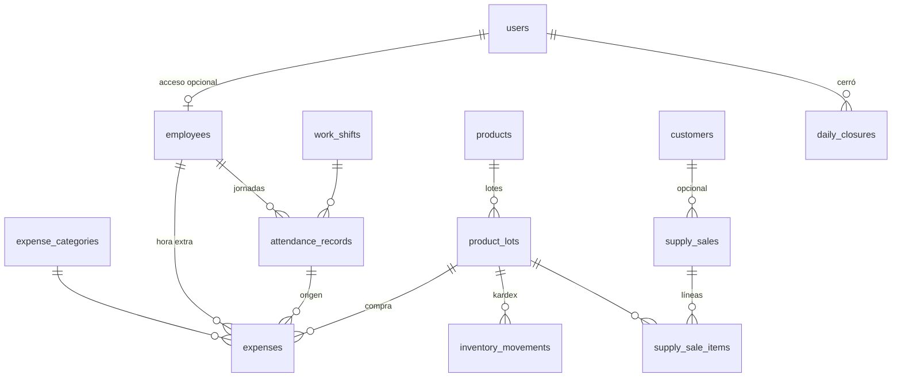

# Plan 0005 — Registro diario: personal, inventario, gastos y cierre

| | |
|---|---|
| **Estado** | 📝 Borrador |
| **Fecha** | 2026-07-27 |
| **Módulos afectados** | `staff`, `inventory`, `expenses`, `daily_close` (+ consolidación del orden de migraciones de toda la fase 1) |
| **Depende de** | [Plan 0001 — Pedidos diarios](../0001-pedidos-diarios/PLAN.md) (customers, orders, enum `payment_method`) y [Plan 0004 — Offline-first](../0004-sincronizacion-offline/PLAN.md) (`SyncableMixin`, aplicador de ops). **Sustituye** el diseño preliminar de inventario del Plan 0001 §12 |

## 1. Contexto

La hoja física **"Registro Diario"** es el último documento del flujo en papel de la
lavandería y el que cierra el alcance de la fase 1 (uso administrativo y de personal
interno). Cada día se registra:

- **Ingresos (lado izquierdo):** las boletas (`#Tomapedido`) que se entregaron/cobraron ese
  día con su monto. Marcas de color: **rosado** = pago por transferencia, **amarillo** =
  cliente pidió factura con NIT, **azul** = ingreso por venta de un insumo (ej. "5
  Detergentes — Q50", "1 Suavizante #14 — Q90").
- **Gastos (lado derecho):** columna "Factura" que en realidad es el **Objeto** (qué se
  pagó: "2 sac", "#7", "Claudia") y columna "Proveedor" que en realidad es la
  **Descripción** (gas, detergente, servicio de moto, secadora, hora extra de empleado…),
  con observaciones (forma de pago, pago atrasado, pendiente de entrega, de realizar,
  pieza pendiente, cobro) y el monto.
- **Total del día:** ingresos − gastos (ej. real: Q995 − Q231 = Q764).
- **Notas del negocio:** se trabaja en **2 turnos de 5 horas** cada uno; la **hora extra
  se paga a Q20**. En las observaciones también anotan entradas/salidas del personal
  ("Entró 6:50 / Salió 13:00"). **No existe registro de precios originales (costo) de los
  insumos**, pero interesa tenerlo.
- Los números "#7" / "#14" junto a los insumos son el **correlativo de lote** del
  producto, lo que confirma el modelo por lotes del Plan 0001 §12.

Este plan digitaliza ese documento completo y, como pieza final de la fase 1, **consolida
el orden definitivo de las migraciones Alembic** de todos los planes (§8).

## 2. Alcance

**Dentro:**

- Empleados, turnos de trabajo, asistencia (entrada/salida) y tarifa de hora extra
  versionada (`staff`).
- Inventario de insumos por lotes con **costo por lote** e **imagen de producto**, ventas
  de insumos como documento propio y kardex de movimientos (`inventory`).
- Gastos del día con categorías administrables y vínculos a empleado (hora extra) o lote
  (compra de insumo) (`expenses`).
- Cierre diario: snapshot inmutable de ingresos/gastos del día con desglose
  efectivo/transferencia, y candado de edición de la fecha (`daily_close`).
- Permisos RBAC nuevos, seeders y las migraciones en su orden (§8).
- Extensión de la tabla de entidades sincronizables del Plan 0004 §6.1/§7.3.

**Fuera (planes futuros):**

- Nómina/planilla completa (aquí solo asistencia y pago de horas extra como gasto).
- Facturación electrónica ante SAT (se sigue registrando solo el NIT).
- Reportes históricos/analítica más allá del cierre diario.
- Fusión de clientes duplicados y demás pendientes de los planes 0001/0004.

## 3. Glosario de dominio

| Término | Significado |
|---|---|
| **Turno** | Bloque fijo de trabajo de 5 horas. Hay 2 por día. |
| **Hora extra** | Tiempo trabajado fuera del turno; se paga a Q20/hora, proporcional por fracción (30 min → Q10, como la "Claudia Extra Q10" de la hoja). El pago aparece como **gasto** del día. |
| **Insumo** | Producto físico que la lavandería compra y puede consumir internamente o vender (detergente, suavizante, cloro…). |
| **Lote** | Compra concreta de un insumo. Correlativo **por producto** ("Suavizante #14"). Cada lote tiene su costo (si se conoce) y su precio de venta. |
| **Venta de insumo** | Ingreso azul de la hoja: venta de mostrador de un insumo. Es un documento propio, **no** una línea de pedido de lavandería. |
| **Kardex** | Historial de movimientos de un lote: entrada por compra, salida por venta, uso interno, ajuste. |
| **Gasto** | Egreso del día: gas, transporte (moto), compra de insumo, hora extra, mantenimiento… |
| **Cierre diario** | Acta del día: totales de ingresos (pedidos + insumos), gastos y neto. Al cerrarse, la fecha queda bloqueada para edición. |
| **Arqueo** | Desglose efectivo vs. transferencia del cierre, para cuadrar caja física. |

## 4. Decisiones de diseño

- **D1 — El ingreso del día son los pagos, no los pedidos.** El "ingreso" de la hoja es lo
  cobrado ese día: `order_payments` con `paid_at` en la fecha. Un pedido con anticipo
  aporta el anticipo el día que se pagó y el saldo el día que se cobró — exactamente la
  regla del papel ("debe coincidir con el tomapedido a menos que haya anticipo").
- **D2 — La venta de insumos es un documento propio** (`supply_sales`), nunca una línea
  del pedido de lavandería. Confirma lo previsto en el Plan 0001 §12.
- **D3 — Inventario por lotes con correlativo por producto.** `lot_number` lo asigna el
  sistema por producto (como el `daily_number` de pedidos). El costo del lote
  (`unit_cost`) es **nullable**: los lotes históricos no tienen costo conocido ("no hay
  registro de precios originales"); toda compra nueva lo captura desde el gasto vinculado.
- **D4 — Kardex como fuente, disponibilidad como cache.** Todo cambio de stock es una fila
  en `inventory_movements`; `product_lots.quantity_available` se actualiza en la misma
  transacción. Auditable y barato de leer.
- **D5 — FIFO al vender.** El vendedor elige producto y cantidad; el service asigna
  lote(s) por orden de `received_at`/`lot_number`. El precio unitario es snapshot del
  `sale_price` del lote (patrón D2 del Plan 0001).
- **D6 — Empleados ≠ usuarios.** `employees` es una tabla propia con `user_id` opcional:
  hay personal sin acceso al sistema y usuarios (admin) que no marcan asistencia. La
  asistencia y las horas extra referencian **empleados**, no usuarios.
- **D7 — Nada de tarifas hardcodeadas.** Turnos en `work_shifts` (administrable) y tarifa
  de hora extra en `payroll_rates` con vigencia (`valid_from`/`valid_to`), mismo patrón
  que `service_prices`. Cambiar la tarifa no toca código ni pagos históricos.
- **D8 — La hora extra se paga como gasto.** Igual que en el papel: el pago sale en los
  gastos del día, con vínculo a `employee_id` (y opcionalmente a la jornada
  `attendance_record_id`). El sistema **sugiere** el monto (minutos × tarifa vigente / 60)
  pero el humano confirma.
- **D9 — El cierre es snapshot + candado.** Al cerrar una fecha se persisten los totales
  calculados y la fecha queda **bloqueada**: pedidos, pagos, gastos y ventas de ese día ya
  no se editan. Reabrir es acción de admin con rastro (tombstone del cierre + auditoría) y
  obliga a re-cerrar.
- **D10 — Imágenes de producto en el servidor, no en la BD.** `products.image_path`
  guarda solo la ruta; el archivo vive en `MEDIA_DIR` (disco local hoy, S3 mañana sin
  tocar el esquema). La app la consume por HTTP con cache; la imagen **no** viaja por el
  protocolo de sync.
- **D11 — Captura operativa offline, administración online.** Asistencia, gastos y ventas
  de insumos ocurren en el mostrador → son ops sincronizables (Plan 0004). Los catálogos
  de este plan (empleados, turnos, tarifas, productos, lotes, categorías de gasto) se
  administran online y bajan por pull, como el catálogo de servicios. El cierre diario es
  **online-only**: cerrar el día exige los datos autoritativos del servidor.
- **D12 — Stock insuficiente al sincronizar = rechazo a revisión.** Una venta offline que
  el servidor no puede cubrir con stock cae a la cola de revisión del Plan 0004 §8. Nada
  de dinero ni stock se fusiona en silencio.
- **D13 — Enums compartidos se crean una sola vez.** `payment_method` (`cash` |
  `transfer`) nace en la migración de `orders` y lo reutilizan `supply_sales` y `expenses`
  con `create_type=False`, como ya hace la migración de `identity`.
- **D14 — Dinero `Numeric(10, 2)`, fecha de negocio `Date` en `America/Guatemala`,
  auditoría en UTC** — heredado de los planes 0001/0004 sin excepciones.
- **D15 — El gas es gasto simple, no insumo.** Es consumo interno de las secadoras; se
  registra en la categoría "Gas" con la cantidad en el concepto ("2 sacos"). Si algún día
  se quiere controlar su stock, basta darlo de alta como producto — sin migración.

## 5. Modelo de datos

Todas las tablas usan `id UUID` (PK, `default=uuid4`), `created_at`/`updated_at` UTC y
**`SyncableMixin`** (`version`, `sync_seq`, `deleted_at`) para viajar en el feed de pull,
sean o no editables offline (mismo criterio que el catálogo en el Plan 0004 §6.1).

### 5.1 Módulo `staff`

**`employees`**

| Campo | Tipo | Notas |
|---|---|---|
| `full_name` | `String(120)` | Obligatorio |
| `phone` | `String(32)` \| null | |
| `user_id` | FK → `users` \| null | Único cuando existe (D6) |
| `notes` | `Text` \| null | |
| `is_active` | `Boolean` | Soft-delete |

**`work_shifts`** — los 2 turnos de 5 horas (administrable por si cambian).

| Campo | Tipo | Notas |
|---|---|---|
| `code` | `String(20)` | Único: `T1`, `T2` |
| `name` | `String(80)` | "Turno mañana" |
| `starts_at` / `ends_at` | `Time` | Hora local del negocio |
| `is_active`, `sort_order` | | |

**`payroll_rates`** — tarifas versionadas (D7).

| Campo | Tipo | Notas |
|---|---|---|
| `code` | `String(50)` | Ej. `overtime_hour` |
| `amount` | `Numeric(10, 2)` | Q20.00 |
| `valid_from` | `Date` | |
| `valid_to` | `Date` \| null | null = vigente. Al registrar una nueva, el service cierra la anterior (patrón `service_prices`) |

**`attendance_records`** — la jornada que hoy se anota en observaciones.

| Campo | Tipo | Notas |
|---|---|---|
| `employee_id` | FK → `employees` | |
| `work_date` | `Date` | Fecha de negocio |
| `shift_id` | FK → `work_shifts` \| null | null = jornada fuera de turno |
| `clock_in` | `Time` | "Entró 6:50" |
| `clock_out` | `Time` \| null | null mientras no marca salida |
| `overtime_minutes` | `Integer` | Default 0. Minutos extra **confirmados** a pagar (el sistema sugiere, el humano decide — D8) |
| `notes` | `Text` \| null | |

Índices: `(work_date)`, `(employee_id, work_date)`.

### 5.2 Módulo `inventory`

**`products`** — los insumos.

| Campo | Tipo | Notas |
|---|---|---|
| `name` | `String(120)` | Único |
| `unit` | `String(30)` | bote, bolsa, galón, saco… |
| `description` | `Text` \| null | |
| `image_path` | `String(255)` \| null | D10 — ruta relativa a `MEDIA_DIR` |
| `is_active`, `sort_order` | | |

**`product_lots`**

| Campo | Tipo | Notas |
|---|---|---|
| `product_id` | FK → `products` | |
| `lot_number` | `Integer` | Correlativo por producto, asignado por el sistema. `UNIQUE(product_id, lot_number)` (D3) |
| `quantity_received` | `Numeric(10, 2)` | > 0 |
| `quantity_available` | `Numeric(10, 2)` | Cache mantenida por el service (D4) |
| `unit_cost` | `Numeric(10, 2)` \| null | null = lote histórico sin costo conocido (D3) |
| `sale_price` | `Numeric(10, 2)` \| null | null = solo uso interno, no se vende |
| `received_at` | `Date` | |

**`supply_sales`** — las filas azules de la hoja.

| Campo | Tipo | Notas |
|---|---|---|
| `sale_date` | `Date` | Fecha de negocio |
| `customer_id` | FK → `customers` \| null | Venta de mostrador anónima permitida |
| `nit` | `String(20)` \| null | Si pide factura (marca amarilla) |
| `payment_method` | enum `payment_method` | Reutiliza el de `order_payments` (D13) |
| `reference` | `String(80)` \| null | No. de transferencia |
| `total` | `Numeric(10, 2)` | Σ líneas; siempre lo calcula el service |
| `sold_by_id` | FK → `users` | |
| `cancelled_at`, `cancelled_by_id`, `cancel_reason` | \| null | Anulación con rastro; devuelve stock |

Índices: `(sale_date)`, `(customer_id)`.

**`supply_sale_items`**

| Campo | Tipo | Notas |
|---|---|---|
| `sale_id` | FK → `supply_sales` | `ondelete=CASCADE` |
| `lot_id` | FK → `product_lots` | Asignado FIFO por el service (D5) |
| `description` | `String(160)` | Snapshot: "Detergente bolsa (lote 7)" |
| `quantity` | `Numeric(10, 2)` | > 0 |
| `unit_price` | `Numeric(10, 2)` | Snapshot del `sale_price` del lote |
| `amount` | `Numeric(10, 2)` | `quantity × unit_price` |

**`inventory_movements`** — kardex (D4).

| Campo | Tipo | Notas |
|---|---|---|
| `lot_id` | FK → `product_lots` | |
| `movement_type` | enum `inventory_movement_type`: `purchase_in` \| `sale_out` \| `internal_use` \| `adjustment` | |
| `quantity` | `Numeric(10, 2)` | > 0; el tipo da el signo |
| `unit_price` | `Numeric(10, 2)` \| null | Solo en `sale_out` |
| `supply_sale_item_id` | FK → `supply_sale_items` \| null | Trazabilidad de la venta |
| `notes` | `Text` \| null | "suavizante usado en pedidos del día", motivo del ajuste… |
| `created_by_id` | FK → `users` | |

Índices: `(lot_id)`, `(movement_type)`.

### 5.3 Módulo `expenses`

**`expense_categories`** — administrable (patrón `garment_types`).

| Campo | Tipo | Notas |
|---|---|---|
| `name` | `String(80)` | Único |
| `is_active`, `sort_order` | | |

**`expenses`**

| Campo | Tipo | Notas |
|---|---|---|
| `expense_date` | `Date` | Fecha de negocio |
| `category_id` | FK → `expense_categories` | |
| `concept` | `String(160)` | El "Objeto + descripción" del papel: "Gas — 2 sacos" |
| `amount` | `Numeric(10, 2)` | > 0 |
| `payment_method` | enum `payment_method` | Default `cash` (D13) |
| `status` | enum `expense_status`: `paid` \| `pending` | `pending` cubre "pago atrasado" / "de realizar" del papel |
| `employee_id` | FK → `employees` \| null | Cuando es hora extra (D8) |
| `attendance_record_id` | FK → `attendance_records` \| null | Jornada que originó la hora extra |
| `product_lot_id` | FK → `product_lots` \| null | Cuando la compra creó un lote de insumo |
| `observations` | `Text` \| null | Pendiente de entrega, pieza pendiente, cobro… |
| `created_by_id` | FK → `users` | |

Índices: `(expense_date)`, `(category_id)`.

### 5.4 Módulo `daily_close`

**`daily_closures`**

| Campo | Tipo | Notas |
|---|---|---|
| `close_date` | `Date` | Único |
| `orders_income` | `Numeric(10, 2)` | Σ `order_payments` del día (D1) |
| `supplies_income` | `Numeric(10, 2)` | Σ ventas de insumos no anuladas |
| `expenses_total` | `Numeric(10, 2)` | Σ gastos del día |
| `net_total` | `Numeric(10, 2)` | Ingresos − gastos |
| `cash_income` / `transfer_income` | `Numeric(10, 2)` | Arqueo: desglose por método de pago |
| `orders_delivered` | `Integer` | Pedidos entregados en la fecha |
| `notes` | `Text` \| null | |
| `closed_by_id` | FK → `users` | |
| `closed_at` | `DateTime(timezone=True)` | |

Los totales son **derivables** pero se persisten como snapshot (D9): el cierre es el acta
del día, inmune a correcciones posteriores del esquema o de reportes.

## 6. Reglas de negocio

### 6.1 Cierre diario — cálculo (validado contra la hoja real del 18/07/26)

| Concepto | Cálculo | Ejemplo real |
|---|---|---|
| Ingreso por pedidos | Σ `order_payments.amount` con `paid_at` en la fecha | Q855 (11 boletas) |
| Ingreso por insumos | Σ `supply_sales.total` no anuladas de la fecha | Q140 (5 detergentes Q50 + 1 suavizante #14 Q90) |
| **Ingresos** | | **Q995** |
| Gastos | Σ `expenses.amount` de la fecha | Q231 (extra Q10, secadora Q20, moto Q10, gas Q161, detergente Q10, extra Q20) |
| **Neto** | ingresos − gastos | **Q764** |
| Arqueo | desglose por `payment_method` | Efectivo Q945, transferencia Q50 (fila rosada) |

Al cerrar: se validan pedidos sin entregar con estado inconsistente (advertencia, no
bloqueo), se persiste el snapshot y la fecha queda bloqueada (D9). `GET
/daily-close/preview` muestra estos mismos números en vivo durante el día — es la hoja de
papel en pantalla.

### 6.2 Horas extra

1. La jornada registra `clock_in`/`clock_out` contra su turno.
2. El sistema sugiere `overtime_minutes` = tiempo trabajado − duración del turno (si > 0).
3. Un humano confirma los minutos (política real: en la hoja pagaron Q10 por media hora).
4. Al pagar, se crea un gasto categoría "Horas extra" con monto sugerido
   `overtime_minutes / 60 × tarifa vigente` (Q20/h → 30 min = Q10 ✔), vinculado a
   `employee_id` y `attendance_record_id`.

### 6.3 Inventario

- **Compra:** alta de lote (correlativo asignado por el sistema) + movimiento
  `purchase_in` + opcionalmente el gasto vinculado en la misma operación. El costo del
  gasto alimenta `unit_cost` — desde hoy sí hay registro de precios originales.
- **Venta:** service asigna lotes FIFO, valida stock, crea `sale_out` por línea y
  descuenta `quantity_available`. Anular la venta revierte con movimientos `adjustment`.
- **Uso interno:** movimiento `internal_use` manual (ej. suavizante consumido en
  pedidos); en el futuro alimentará el costo real por pedido.
- **Stock del producto** = Σ `quantity_available` de sus lotes (derivado, no almacenado).

### 6.4 Sincronización (extiende Plan 0004 §7.3)

| Entidad | Dirección | Ops offline permitidas |
|---|---|---|
| `employees`, `work_shifts`, `payroll_rates`, `expense_categories`, `products`, `product_lots` | Servidor → app | Ninguna (admin edita online, D11) |
| `attendance_records` | Bidireccional | `create`, `update` |
| `expenses` | Bidireccional | `create`, `update` (hasta cierre del día) |
| `supply_sales` (+ items) | Bidireccional | `create`, `cancel` |
| `inventory_movements` | Servidor → app | Ninguna (los genera el service) |
| `daily_closures` | Servidor → app | Ninguna (cerrar es online-only, D11) |

Conflictos nuevos (se suman a la tabla del Plan 0004 §8):

| Caso | Detección | Resolución |
|---|---|---|
| Venta offline sin stock suficiente al aplicar | Service de inventario | `rejected` a revisión con stock actual adjunto (D12) |
| Gasto/venta/asistencia sobre una fecha ya cerrada | `daily_closures` | `rejected`: "el día X está cerrado; pida a un admin reabrirlo" |
| Precio de venta del lote cambió mientras la venta estaba offline | Recalculo al aplicar (D10 del Plan 0004) | Se aplica con cifras del servidor; la app actualiza y señala |

## 7. API v1

### `staff`

| Método y ruta | Permiso | Descripción |
|---|---|---|
| `GET /staff/employees` | `staff.read` | |
| `POST /staff/employees` / `PATCH …/{id}` | `staff.manage` | Admin |
| `GET /staff/shifts` | `staff.read` | |
| `POST /staff/shifts` / `PATCH …/{id}` | `staff.manage` | Admin |
| `GET /staff/rates` / `POST /staff/rates` | `staff.manage` | Nueva vigencia de tarifa (cierra la anterior) |
| `POST /staff/attendance` | `attendance.record` | Marcar entrada / registrar jornada |
| `PATCH /staff/attendance/{id}` | `attendance.record` | Marcar salida; confirmar minutos extra |
| `GET /staff/attendance?date=&employee_id=` | `staff.read` | |

### `inventory`

| Método y ruta | Permiso | Descripción |
|---|---|---|
| `GET /inventory/products` | `inventory.read` | Con stock disponible agregado |
| `POST /inventory/products` / `PATCH …/{id}` | `inventory.manage` | Admin |
| `PUT /inventory/products/{id}/image` | `inventory.manage` | Multipart; guarda en `MEDIA_DIR`, responde `image_path` (D10) |
| `POST /inventory/products/{id}/lots` | `inventory.manage` | Alta de lote; opcionalmente crea el gasto vinculado (§6.3) |
| `GET /inventory/products/{id}/lots` | `inventory.read` | |
| `POST /inventory/movements` | `inventory.adjust` | `internal_use` / `adjustment` |
| `GET /inventory/movements?product_id=&date=` | `inventory.read` | Kardex |
| `POST /supply-sales` | `supply_sales.create` | Líneas por producto+cantidad; el service asigna lotes (D5) |
| `GET /supply-sales?date=&page=` | `supply_sales.read` | |
| `POST /supply-sales/{id}/cancel` | `supply_sales.cancel` | Motivo obligatorio; devuelve stock |

### `expenses`

| Método y ruta | Permiso | Descripción |
|---|---|---|
| `GET /expenses?date=&category_id=&status=` | `expenses.read` | |
| `POST /expenses` | `expenses.create` | |
| `PATCH /expenses/{id}` | `expenses.update` | Hasta que la fecha esté cerrada |
| `DELETE /expenses/{id}` | `expenses.void` | Tombstone con rastro (admin) |
| `GET /expenses/categories` | `expenses.read` | |
| `POST /expenses/categories` / `PATCH …/{id}` | `expenses.manage_categories` | Admin |

### `daily-close`

| Método y ruta | Permiso | Descripción |
|---|---|---|
| `GET /daily-close/preview?date=` | `daily_close.read` | Totales en vivo (§6.1) — la hoja en pantalla |
| `POST /daily-close` | `daily_close.close` | Cierra la fecha; snapshot + candado (D9) |
| `GET /daily-close?from=&to=` | `daily_close.read` | Histórico |
| `POST /daily-close/{id}/reopen` | `daily_close.reopen` | Admin; tombstone + auditoría; obliga a re-cerrar |

### Permisos RBAC

| Permiso (`resource.action`) | Admin | Colaborador |
|---|---|---|
| `staff.read` | ✔ | ✔ |
| `staff.manage` | ✔ | ✖ |
| `attendance.record` | ✔ | ✔ |
| `inventory.read` | ✔ | ✔ |
| `inventory.manage` / `inventory.adjust` | ✔ | ✖ |
| `supply_sales.create` / `read` | ✔ | ✔ |
| `supply_sales.cancel` | ✔ | ✖ |
| `expenses.read` / `create` | ✔ | ✔ |
| `expenses.update` / `void` / `manage_categories` | ✔ | ✖ |
| `daily_close.read` | ✔ | ✔ |
| `daily_close.close` / `reopen` | ✔ | ✖ |

## 8. Migraciones — orden consolidado de la fase 1

Esta sección es el **plan de migraciones de todo el sistema** (planes 0001 + 0004 + 0005).
Cadena lineal de Alembic, un solo head, cada migración con `downgrade()` completo, patrón
de nombres `AAAAMMDD_NNNN_slug` (la fecha real la pone el día que se genere el archivo; lo
invariante es el **orden** y la cadena `down_revision`).

### 8.1 ¿Se editan migraciones previas?

**No.** La única migración existente, `20260714_0001_identity_rbac`, queda intacta porque:

1. `identity` **no se sincroniza** (Plan 0004 §6.1) → no necesita `SyncableMixin`.
2. Los empleados se modelan en tabla propia con `user_id` opcional (D6) → `users` no
   cambia.
3. Los permisos y roles nuevos son **seeders** (datos), no DDL.

Si más adelante una migración previa necesitara corrección real, mientras no exista un
entorno productivo compartido es válido editarla en lugar de parcharla — pero hoy no hace
falta.

### 8.2 Cadena de migraciones

| # | Revisión (slug) | Contenido (DDL) | Origen | Depende de |
|---|---|---|---|---|
| 1 | `0001_identity_rbac` | **Existente, sin cambios**: users, roles, permissions, sesiones, tokens; enums `permission_effect`, `reset_channel` | identity | — |
| 2 | `0002_sync_core` | Secuencia global de `sync_seq`; `sync_devices`, `sync_operations`; enum `sync_op_status` | 0004 · PR S1 | 1 |
| 3 | `0003_catalog` | `service_types`, `service_options`, `service_prices`, `garment_types` — todas con `SyncableMixin` (aquí y en adelante) | 0001 · PR 1 | 2 |
| 4 | `0004_customers` | `customers` | 0001 · PR 2 | 2 |
| 5 | `0005_orders` | Enums `order_status`, **`payment_method`** (compartido, D13); `orders`, `order_garments`, `order_charges`, `order_discounts`, `order_payments` | 0001 · PR 3–4 | 3, 4 |
| 6 | `0006_promotions` | `promotions` | 0001 · PR 5 | 3 |
| 7 | `0007_staff` | `employees`, `work_shifts`, `payroll_rates`, `attendance_records` | **0005** | 2 |
| 8 | `0008_inventory` | Enum `inventory_movement_type`; `products`, `product_lots`, `supply_sales`, `supply_sale_items`, `inventory_movements` | **0005** | 4 (FK customers), 5 (enum `payment_method`) |
| 9 | `0009_expenses` | Enum `expense_status`; `expense_categories`, `expenses` | **0005** | 7 (FK employees/attendance), 8 (FK lots) |
| 10 | `0010_daily_close` | `daily_closures` | **0005** | 5, 8, 9 (conceptual: cierra pagos+ventas+gastos; DDL solo exige users) |

Notas:

- El orden 3–6 vs. 7 es flexible (7 solo depende de 2), pero se fija esta secuencia para
  que la cadena refleje el orden de los PRs y evitar heads paralelos.
- Toda tabla desde la #3 nace con `version`, `sync_seq` (índice) y `deleted_at`
  (`SyncableMixin`), incluso las pull-only — necesitan viajar en el feed (§6.4).
- Enums siempre con el patrón `create_type=False` + `checkfirst=True` de la migración
  existente, creados una única vez en la migración que los introduce.

### 8.3 Seeders (idempotentes, en `scripts/`)

| Seeder | Contenido | Origen |
|---|---|---|
| `seed_catalog.py` | Servicios, opciones, precios y 21 tipos de prenda | 0001 §10 |
| `seed_promotions.py` | `domicilio_50`, `edredon_q5`, `edredon_jul2026` | 0001 §10 |
| `seed_staff.py` | Turnos `T1` 07:00–12:00 y `T2` 13:00–18:00 (horas por confirmar, §10.1); tarifa `overtime_hour` Q20 vigente | **0005** |
| `seed_expense_categories.py` | Horas extra, Gas, Transporte (moto), Compra de insumos, Mantenimiento de equipo, Otros | **0005** |
| `seed_products.py` | Detergente, Suavizante, Cloro (sin imagen; el admin la sube después) | **0005** |
| `seed_permissions.py` | Roles `admin`/`collaborator` + permisos de 0001 §9 **y** de este plan §7 (un solo seeder acumulativo) | 0001 + 0005 |

### 8.4 Settings nuevos

| Setting | Default | Notas |
|---|---|---|
| `MEDIA_DIR` | `./media` | Raíz de archivos de imagen (D10) |
| `MEDIA_MAX_IMAGE_MB` | `5` | Límite de subida |
| `MEDIA_ALLOWED_FORMATS` | `jpg,jpeg,png,webp` | |

## 9. Plan de implementación

Continúa la numeración conjunta de los planes 0001 (PR 1–6) y 0004 (PR S1–S6). Cada PR
lleva su migración (§8.2), seeders, tests unitarios e integración (Testcontainers), en el
patrón `models → schemas → repository → service → endpoints`.

| Fase | Contenido | Depende de |
|---|---|---|
| **PR 7 — `staff`** | Migración 7, empleados, turnos, tarifas, asistencia, cálculo de extra sugerido, seeder | S1 (mixin) |
| **PR 8 — `inventory`** | Migración 8, productos + imagen (media), lotes FIFO, kardex, ventas de insumos con anulación, seeder | PR 2 (customers), PR 3 (enum) |
| **PR 9 — `expenses`** | Migración 9, categorías + gastos con vínculos a empleado/lote, seeder | PR 7, PR 8 |
| **PR 10 — `daily_close`** | Migración 10, preview + cierre + candado + reapertura; validación cruzada con pagos/ventas/gastos | PR 4 (pagos), PR 8, PR 9 |
| **PR 11 — sync de los módulos nuevos** | Aplicadores de ops `attendance`, `expenses`, `supply_sales`; pull de los catálogos nuevos; conflictos de §6.4 | S4 + PR 7–9 |
| **PR 12 — permisos y cierre de fase 1** | Seeder RBAC completo, revisión de índices, documentación de API | Todos |

El candado de fecha (D9) se implementa en los services de `orders`, `expenses` y
`supply_sales` desde el PR 10 (verificación contra `daily_closures` antes de mutar).

## 10. Preguntas abiertas

1. **Horarios exactos de los turnos**: se siembra 07:00–12:00 / 13:00–18:00 como
   hipótesis (la hoja muestra entradas 6:50 y salidas 18:50). Confirmar con el negocio.
2. **Tarifa de hora extra por empleado**: hoy Q20/h global (`payroll_rates`). Si algún
   empleado gana distinto, la tabla admitiría un `employee_id` nullable — ¿se necesita?
3. **Categorías de gasto definitivas**: validar la lista sembrada (§8.3) con el negocio;
   "Secadora Q20" de la hoja — ¿mantenimiento, fichas, alquiler?
4. **Etiquetas de la hoja** ("pendiente de entrega", "pieza pendiente", "cobro"): ¿bastan
   `status` + observaciones libres, o alguna merece estado formal propio?
5. **Costo estimado de lotes históricos**: ¿capturar un costo aproximado al migrar el
   stock actual, o dejarlo null hasta que roten los lotes?
6. **Venta de insumos a crédito**: se asume pago inmediato (no hay saldo pendiente en
   ventas de mostrador). ¿Correcto?
7. **¿Quién cierra el día?**: default admin-only (`daily_close.close`). ¿Algún
   colaborador de confianza debería poder?

## Historial

| Fecha | Cambio |
|---|---|
| 2026-07-27 | Versión inicial a partir de la hoja "Registro Diario" (18/07/26) y sus aclaraciones: columnas reales (Objeto/Descripción), marcas de color, turnos 2×5h, hora extra Q20, lotes #7/#14, ausencia de costos históricos de insumos. Consolida el orden de migraciones de la fase 1 (§8). |
| 2026-07-27 | Confirmado con el negocio: cierre con snapshot + candado (D9), empleados con login opcional (D6), captura offline de ventas/gastos/asistencia (D11), y gas como gasto simple (nueva D15, resuelve la ex-pregunta abierta 3). |
