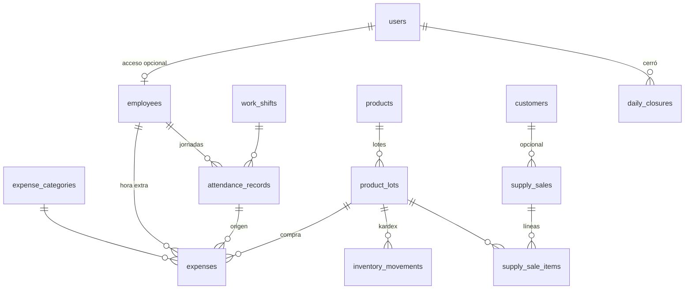

# Plan 0005 — Registro diario: personal, inventario, gastos y cierre

| | |
|---|---|
| **Estado** | ✔️ Implementado (PR 7–12; cierra la fase 1 del backend) |
| **Fecha** | 2026-07-27 |
| **Módulos afectados** | `staff`, `inventory`, `expenses`, `daily_close` (+ consolidación del orden de migraciones de toda la fase 1) |
| **Depende de** | [Plan 0001 — Pedidos diarios](../0001-pedidos-diarios/PLAN.md) (customers, orders, enum `payment_method`) y [Plan 0004 — Offline-first](../0004-sincronizacion-offline/PLAN.md) (`SyncableMixin`, aplicador de ops). **Sustituye** el diseño preliminar de inventario del Plan 0001 §12 |

## 1. Contexto

La hoja física **"Registro Diario"** es el último documento del flujo en papel de la
lavandería y el que cierra el alcance de la fase 1 (uso administrativo y de personal
interno). Cada día se registra:

- **Ingresos (lado izquierdo):** las boletas (`#Tomapedido`) que se entregaron/cobraron ese
  día con su monto. Marcas de color: **rosado** = pago por transferencia, **amarillo** =
  cliente pidió factura con NIT, **azul** = ingreso por venta de un insumo (ej. "5
  Detergentes — Q50", "1 Suavizante #14 — Q90").
- **Gastos (lado derecho):** columna "Factura" que en realidad es el **Objeto** (qué se
  pagó: "2 sac", "#7", "Claudia") y columna "Proveedor" que en realidad es la
  **Descripción** (gas, detergente, servicio de moto, secadora, hora extra de empleado…),
  con observaciones (forma de pago, pago atrasado, pendiente de entrega, de realizar,
  pieza pendiente, cobro) y el monto.
- **Total del día:** ingresos − gastos (ej. real: Q995 − Q231 = Q764).
- **Notas del negocio:** se trabaja en **2 turnos de 5 horas** cada uno; la **hora extra
  se paga a Q20**. En las observaciones también anotan entradas/salidas del personal
  ("Entró 6:50 / Salió 13:00"). **No existe registro de precios originales (costo) de los
  insumos**, pero interesa tenerlo.
- Los números "#7" / "#14" junto a los insumos son el **correlativo de lote** del
  producto, lo que confirma el modelo por lotes del Plan 0001 §12.

Este plan digitaliza ese documento completo y, como pieza final de la fase 1, **consolida
el orden definitivo de las migraciones Alembic** de todos los planes (§8).

## 2. Alcance

**Dentro:**

- Empleados, turnos de trabajo, asistencia (entrada/salida) y tarifa de hora extra
  versionada (`staff`).
- Inventario de insumos por lotes con **costo por lote** e **imagen de producto**, ventas
  de insumos como documento propio y kardex de movimientos (`inventory`).
- Gastos del día con categorías administrables y vínculos a empleado (hora extra) o lote
  (compra de insumo) (`expenses`).
- Cierre diario: snapshot inmutable de ingresos/gastos del día con desglose
  efectivo/transferencia, y candado de edición de la fecha (`daily_close`).
- Permisos RBAC nuevos, seeders y las migraciones en su orden (§8).
- Extensión de la tabla de entidades sincronizables del Plan 0004 §6.1/§7.3.

**Fuera (planes futuros):**

- Nómina/planilla completa (aquí solo asistencia y pago de horas extra como gasto).
- Facturación electrónica ante SAT (se sigue registrando solo el NIT).
- Reportes históricos/analítica más allá del cierre diario.
- Fusión de clientes duplicados y demás pendientes de los planes 0001/0004.

## 3. Glosario de dominio

| Término | Significado |
|---|---|
| **Turno** | Bloque fijo de trabajo de 5 horas. Hay 2 por día. |
| **Hora extra** | Tiempo trabajado fuera del turno; se paga a Q20/hora, proporcional por fracción (30 min → Q10, como la "Claudia Extra Q10" de la hoja). El pago aparece como **gasto** del día. |
| **Insumo** | Producto físico que la lavandería compra y puede consumir internamente o vender (detergente, suavizante, cloro…). |
| **Lote** | Compra concreta de un insumo. Correlativo **por producto** ("Suavizante #14"). Cada lote tiene su costo (si se conoce) y su precio de venta. |
| **Venta de insumo** | Ingreso azul de la hoja: venta de mostrador de un insumo. Es un documento propio, **no** una línea de pedido de lavandería. |
| **Kardex** | Historial de movimientos de un lote: entrada por compra, salida por venta, uso interno, ajuste. |
| **Gasto** | Egreso del día: gas, transporte (moto), compra de insumo, hora extra, mantenimiento… |
| **Cierre diario** | Acta del día: totales de ingresos (pedidos + insumos), gastos y neto. Al cerrarse, la fecha queda bloqueada para edición. |
| **Arqueo** | Desglose efectivo vs. transferencia del cierre, para cuadrar caja física. |

## 4. Decisiones de diseño

- **D1 — El ingreso del día son los pagos, no los pedidos.** El "ingreso" de la hoja es lo
  cobrado ese día: `order_payments` con `paid_at` en la fecha. Un pedido con anticipo
  aporta el anticipo el día que se pagó y el saldo el día que se cobró — exactamente la
  regla del papel ("debe coincidir con el tomapedido a menos que haya anticipo").
- **D2 — La venta de insumos es un documento propio** (`supply_sales`), nunca una línea
  del pedido de lavandería. Confirma lo previsto en el Plan 0001 §12.
- **D3 — Inventario por lotes con correlativo por producto.** `lot_number` lo asigna el
  sistema por producto (como el `daily_number` de pedidos). El costo del lote
  (`unit_cost`) es **nullable**: los lotes históricos no tienen costo conocido ("no hay
  registro de precios originales"); toda compra nueva lo captura desde el gasto vinculado.
- **D4 — Kardex como fuente, disponibilidad como cache.** Todo cambio de stock es una fila
  en `inventory_movements`; `product_lots.quantity_available` se actualiza en la misma
  transacción. Auditable y barato de leer.
- **D5 — FIFO al vender.** El vendedor elige producto y cantidad; el service asigna
  lote(s) por orden de `received_at`/`lot_number`. El precio unitario es snapshot del
  `sale_price` del lote (patrón D2 del Plan 0001).
- **D6 — Empleados ≠ usuarios.** `employees` es una tabla propia con `user_id` opcional:
  hay personal sin acceso al sistema y usuarios (admin) que no marcan asistencia. La
  asistencia y las horas extra referencian **empleados**, no usuarios.
- **D7 — Nada de tarifas hardcodeadas.** Turnos en `work_shifts` (administrable) y tarifa
  de hora extra en `payroll_rates` con vigencia (`valid_from`/`valid_to`), mismo patrón
  que `service_prices`. Cambiar la tarifa no toca código ni pagos históricos.
- **D8 — La hora extra se paga como gasto.** Igual que en el papel: el pago sale en los
  gastos del día, con vínculo a `employee_id` (y opcionalmente a la jornada
  `attendance_record_id`). El sistema **sugiere** el monto (minutos × tarifa vigente / 60)
  pero el humano confirma.
- **D9 — El cierre es snapshot + candado.** Al cerrar una fecha se persisten los totales
  calculados y la fecha queda **bloqueada**: pedidos, pagos, gastos y ventas de ese día ya
  no se editan. Reabrir es acción de admin con rastro (tombstone del cierre + auditoría) y
  obliga a re-cerrar.
- **D10 — Imágenes de producto en el servidor, no en la BD.** `products.image_path`
  guarda solo la ruta; el archivo vive en `MEDIA_DIR` (disco local hoy, S3 mañana sin
  tocar el esquema). La app la consume por HTTP con cache; la imagen **no** viaja por el
  protocolo de sync.
- **D11 — Captura operativa offline, administración online.** Asistencia, gastos y ventas
  de insumos ocurren en el mostrador → son ops sincronizables (Plan 0004). Los catálogos
  de este plan (empleados, turnos, tarifas, productos, lotes, categorías de gasto) se
  administran online y bajan por pull, como el catálogo de servicios. El cierre diario es
  **online-only**: cerrar el día exige los datos autoritativos del servidor.
- **D12 — Stock insuficiente al sincronizar = rechazo a revisión.** Una venta offline que
  el servidor no puede cubrir con stock cae a la cola de revisión del Plan 0004 §8. Nada
  de dinero ni stock se fusiona en silencio.
- **D13 — Enums compartidos se crean una sola vez.** `payment_method` (`cash` |
  `transfer`) nace en la migración de `orders` y lo reutilizan `supply_sales` y `expenses`
  con `create_type=False`, como ya hace la migración de `identity`.
- **D14 — Dinero `Numeric(10, 2)`, fecha de negocio `Date` en `America/Guatemala`,
  auditoría en UTC** — heredado de los planes 0001/0004 sin excepciones.
- **D15 — El gas es gasto simple, no insumo.** Es consumo interno de las secadoras; se
  registra en la categoría "Gas" con la cantidad en el concepto ("2 sacos"). Si algún día
  se quiere controlar su stock, basta darlo de alta como producto — sin migración.

## 5. Modelo de datos

Todas las tablas usan `id UUID` (PK, `default=uuid4`), `created_at`/`updated_at` UTC y
**`SyncableMixin`** (`version`, `sync_seq`, `deleted_at`) para viajar en el feed de pull,
sean o no editables offline (mismo criterio que el catálogo en el Plan 0004 §6.1).

### 5.1 Módulo `staff`

**`employees`**

| Campo | Tipo | Notas |
|---|---|---|
| `full_name` | `String(120)` | Obligatorio |
| `phone` | `String(32)` \| null | |
| `user_id` | FK → `users` \| null | Único cuando existe (D6) |
| `notes` | `Text` \| null | |
| `is_active` | `Boolean` | Soft-delete |

**`work_shifts`** — los 2 turnos de 5 horas (administrable por si cambian).

| Campo | Tipo | Notas |
|---|---|---|
| `code` | `String(20)` | Único: `T1`, `T2` |
| `name` | `String(80)` | "Turno mañana" |
| `starts_at` / `ends_at` | `Time` | Hora local del negocio |
| `is_active`, `sort_order` | | |

**`payroll_rates`** — tarifas versionadas (D7).

| Campo | Tipo | Notas |
|---|---|---|
| `code` | `String(50)` | Ej. `overtime_hour` |
| `amount` | `Numeric(10, 2)` | Q20.00 |
| `valid_from` | `Date` | |
| `valid_to` | `Date` \| null | null = vigente. Al registrar una nueva, el service cierra la anterior (patrón `service_prices`) |

**`attendance_records`** — la jornada que hoy se anota en observaciones.

| Campo | Tipo | Notas |
|---|---|---|
| `employee_id` | FK → `employees` | |
| `work_date` | `Date` | Fecha de negocio |
| `shift_id` | FK → `work_shifts` \| null | null = jornada fuera de turno |
| `clock_in` | `Time` | "Entró 6:50" |
| `clock_out` | `Time` \| null | null mientras no marca salida |
| `overtime_minutes` | `Integer` | Default 0. Minutos extra **confirmados** a pagar (el sistema sugiere, el humano decide — D8) |
| `notes` | `Text` \| null | |

Índices: `(work_date)`, `(employee_id, work_date)`.

### 5.2 Módulo `inventory`

**`products`** — los insumos.

| Campo | Tipo | Notas |
|---|---|---|
| `name` | `String(120)` | Único |
| `unit` | `String(30)` | bote, bolsa, galón, saco… |
| `description` | `Text` \| null | |
| `image_path` | `String(255)` \| null | D10 — ruta relativa a `MEDIA_DIR` |
| `is_active`, `sort_order` | | |

**`product_lots`**

| Campo | Tipo | Notas |
|---|---|---|
| `product_id` | FK → `products` | |
| `lot_number` | `Integer` | Correlativo por producto, asignado por el sistema. `UNIQUE(product_id, lot_number)` (D3) |
| `quantity_received` | `Numeric(10, 2)` | > 0 |
| `quantity_available` | `Numeric(10, 2)` | Cache mantenida por el service (D4) |
| `unit_cost` | `Numeric(10, 2)` \| null | null = lote histórico sin costo conocido (D3) |
| `sale_price` | `Numeric(10, 2)` \| null | null = solo uso interno, no se vende |
| `received_at` | `Date` | |

**`supply_sales`** — las filas azules de la hoja.

| Campo | Tipo | Notas |
|---|---|---|
| `sale_date` | `Date` | Fecha de negocio |
| `customer_id` | FK → `customers` \| null | Venta de mostrador anónima permitida |
| `nit` | `String(20)` \| null | Si pide factura (marca amarilla) |
| `payment_method` | enum `payment_method` | Reutiliza el de `order_payments` (D13) |
| `reference` | `String(80)` \| null | No. de transferencia |
| `total` | `Numeric(10, 2)` | Σ líneas; siempre lo calcula el service |
| `sold_by_id` | FK → `users` | |
| `cancelled_at`, `cancelled_by_id`, `cancel_reason` | \| null | Anulación con rastro; devuelve stock |

Índices: `(sale_date)`, `(customer_id)`.

**`supply_sale_items`**

| Campo | Tipo | Notas |
|---|---|---|
| `sale_id` | FK → `supply_sales` | `ondelete=CASCADE` |
| `lot_id` | FK → `product_lots` | Asignado FIFO por el service (D5) |
| `description` | `String(160)` | Snapshot: "Detergente bolsa (lote 7)" |
| `quantity` | `Numeric(10, 2)` | > 0 |
| `unit_price` | `Numeric(10, 2)` | Snapshot del `sale_price` del lote |
| `amount` | `Numeric(10, 2)` | `quantity × unit_price` |

**`inventory_movements`** — kardex (D4).

| Campo | Tipo | Notas |
|---|---|---|
| `lot_id` | FK → `product_lots` | |
| `movement_type` | enum `inventory_movement_type`: `purchase_in` \| `sale_out` \| `internal_use` \| `adjustment` | |
| `quantity` | `Numeric(10, 2)` | > 0; el tipo da el signo |
| `unit_price` | `Numeric(10, 2)` \| null | Solo en `sale_out` |
| `supply_sale_item_id` | FK → `supply_sale_items` \| null | Trazabilidad de la venta |
| `notes` | `Text` \| null | "suavizante usado en pedidos del día", motivo del ajuste… |
| `created_by_id` | FK → `users` | |

Índices: `(lot_id)`, `(movement_type)`.

### 5.3 Módulo `expenses`

**`expense_categories`** — administrable (patrón `garment_types`).

| Campo | Tipo | Notas |
|---|---|---|
| `name` | `String(80)` | Único |
| `is_active`, `sort_order` | | |

**`expenses`**

| Campo | Tipo | Notas |
|---|---|---|
| `expense_date` | `Date` | Fecha de negocio |
| `category_id` | FK → `expense_categories` | |
| `concept` | `String(160)` | El "Objeto + descripción" del papel: "Gas — 2 sacos" |
| `amount` | `Numeric(10, 2)` | > 0 |
| `payment_method` | enum `payment_method` | Default `cash` (D13) |
| `status` | enum `expense_status`: `paid` \| `pending` | `pending` cubre "pago atrasado" / "de realizar" del papel |
| `employee_id` | FK → `employees` \| null | Cuando es hora extra (D8) |
| `attendance_record_id` | FK → `attendance_records` \| null | Jornada que originó la hora extra |
| `product_lot_id` | FK → `product_lots` \| null | Cuando la compra creó un lote de insumo |
| `observations` | `Text` \| null | Pendiente de entrega, pieza pendiente, cobro… |
| `created_by_id` | FK → `users` | |

Índices: `(expense_date)`, `(category_id)`.

### 5.4 Módulo `daily_close`

**`daily_closures`**

| Campo | Tipo | Notas |
|---|---|---|
| `close_date` | `Date` | Único |
| `orders_income` | `Numeric(10, 2)` | Σ `order_payments` del día (D1) |
| `supplies_income` | `Numeric(10, 2)` | Σ ventas de insumos no anuladas |
| `expenses_total` | `Numeric(10, 2)` | Σ gastos del día |
| `net_total` | `Numeric(10, 2)` | Ingresos − gastos |
| `cash_income` / `transfer_income` | `Numeric(10, 2)` | Arqueo: desglose por método de pago |
| `orders_delivered` | `Integer` | Pedidos entregados en la fecha |
| `notes` | `Text` \| null | |
| `closed_by_id` | FK → `users` | |
| `closed_at` | `DateTime(timezone=True)` | |

Los totales son **derivables** pero se persisten como snapshot (D9): el cierre es el acta
del día, inmune a correcciones posteriores del esquema o de reportes.

## 6. Reglas de negocio

### 6.1 Cierre diario — cálculo (validado contra la hoja real del 18/07/26)

| Concepto | Cálculo | Ejemplo real |
|---|---|---|
| Ingreso por pedidos | Σ `order_payments.amount` con `paid_at` en la fecha | Q855 (11 boletas) |
| Ingreso por insumos | Σ `supply_sales.total` no anuladas de la fecha | Q140 (5 detergentes Q50 + 1 suavizante #14 Q90) |
| **Ingresos** | | **Q995** |
| Gastos | Σ `expenses.amount` de la fecha | Q231 (extra Q10, secadora Q20, moto Q10, gas Q161, detergente Q10, extra Q20) |
| **Neto** | ingresos − gastos | **Q764** |
| Arqueo | desglose por `payment_method` | Efectivo Q945, transferencia Q50 (fila rosada) |

Al cerrar: se validan pedidos sin entregar con estado inconsistente (advertencia, no
bloqueo), se persiste el snapshot y la fecha queda bloqueada (D9). `GET
/daily-close/preview` muestra estos mismos números en vivo durante el día — es la hoja de
papel en pantalla.

### 6.2 Horas extra

1. La jornada registra `clock_in`/`clock_out` contra su turno.
2. El sistema sugiere `overtime_minutes` = tiempo trabajado − duración del turno (si > 0).
3. Un humano confirma los minutos (política real: en la hoja pagaron Q10 por media hora).
4. Al pagar, se crea un gasto categoría "Horas extra" con monto sugerido
   `overtime_minutes / 60 × tarifa vigente` (Q20/h → 30 min = Q10 ✔), vinculado a
   `employee_id` y `attendance_record_id`.

### 6.3 Inventario

- **Compra:** alta de lote (correlativo asignado por el sistema) + movimiento
  `purchase_in` + opcionalmente el gasto vinculado en la misma operación. El costo del
  gasto alimenta `unit_cost` — desde hoy sí hay registro de precios originales.
- **Venta:** service asigna lotes FIFO, valida stock, crea `sale_out` por línea y
  descuenta `quantity_available`. Anular la venta revierte con movimientos `adjustment`.
- **Uso interno:** movimiento `internal_use` manual (ej. suavizante consumido en
  pedidos); en el futuro alimentará el costo real por pedido.
- **Stock del producto** = Σ `quantity_available` de sus lotes (derivado, no almacenado).

### 6.4 Sincronización (extiende Plan 0004 §7.3)

| Entidad | Dirección | Ops offline permitidas |
|---|---|---|
| `employees`, `work_shifts`, `payroll_rates`, `expense_categories`, `products`, `product_lots` | Servidor → app | Ninguna (admin edita online, D11) |
| `attendance_records` | Bidireccional | `create`, `update` |
| `expenses` | Bidireccional | `create`, `update` (hasta cierre del día) |
| `supply_sales` (+ items) | Bidireccional | `create`, `cancel` |
| `inventory_movements` | Servidor → app | Ninguna (los genera el service) |
| `daily_closures` | Servidor → app | Ninguna (cerrar es online-only, D11) |

Conflictos nuevos (se suman a la tabla del Plan 0004 §8):

| Caso | Detección | Resolución |
|---|---|---|
| Venta offline sin stock suficiente al aplicar | Service de inventario | `rejected` a revisión con stock actual adjunto (D12) |
| Gasto/venta/asistencia sobre una fecha ya cerrada | `daily_closures` | `rejected`: "el día X está cerrado; pida a un admin reabrirlo" |
| Precio de venta del lote cambió mientras la venta estaba offline | Recalculo al aplicar (D10 del Plan 0004) | Se aplica con cifras del servidor; la app actualiza y señala |

## 7. API v1

### `staff`

| Método y ruta | Permiso | Descripción |
|---|---|---|
| `GET /staff/employees` | `staff.read` | |
| `POST /staff/employees` / `PATCH …/{id}` | `staff.manage` | Admin |
| `GET /staff/shifts` | `staff.read` | |
| `POST /staff/shifts` / `PATCH …/{id}` | `staff.manage` | Admin |
| `GET /staff/rates` / `POST /staff/rates` | `staff.manage` | Nueva vigencia de tarifa (cierra la anterior) |
| `POST /staff/attendance` | `attendance.record` | Marcar entrada / registrar jornada |
| `PATCH /staff/attendance/{id}` | `attendance.record` | Marcar salida; confirmar minutos extra |
| `GET /staff/attendance?date=&employee_id=` | `staff.read` | |

### `inventory`

| Método y ruta | Permiso | Descripción |
|---|---|---|
| `GET /inventory/products` | `inventory.read` | Con stock disponible agregado |
| `POST /inventory/products` / `PATCH …/{id}` | `inventory.manage` | Admin |
| `PUT /inventory/products/{id}/image` | `inventory.manage` | Multipart; guarda en `MEDIA_DIR`, responde `image_path` (D10) |
| `POST /inventory/products/{id}/lots` | `inventory.manage` | Alta de lote; opcionalmente crea el gasto vinculado (§6.3) |
| `GET /inventory/products/{id}/lots` | `inventory.read` | |
| `POST /inventory/movements` | `inventory.adjust` | `internal_use` / `adjustment` |
| `GET /inventory/movements?product_id=&date=` | `inventory.read` | Kardex |
| `POST /supply-sales` | `supply_sales.create` | Líneas por producto+cantidad; el service asigna lotes (D5) |
| `GET /supply-sales?date=&page=` | `supply_sales.read` | |
| `POST /supply-sales/{id}/cancel` | `supply_sales.cancel` | Motivo obligatorio; devuelve stock |

### `expenses`

| Método y ruta | Permiso | Descripción |
|---|---|---|
| `GET /expenses?date=&category_id=&status=` | `expenses.read` | |
| `POST /expenses` | `expenses.create` | |
| `PATCH /expenses/{id}` | `expenses.update` | Hasta que la fecha esté cerrada |
| `DELETE /expenses/{id}` | `expenses.void` | Tombstone con rastro (admin) |
| `GET /expenses/categories` | `expenses.read` | |
| `POST /expenses/categories` / `PATCH …/{id}` | `expenses.manage_categories` | Admin |

### `daily-close`

| Método y ruta | Permiso | Descripción |
|---|---|---|
| `GET /daily-close/preview?date=` | `daily_close.read` | Totales en vivo (§6.1) — la hoja en pantalla |
| `POST /daily-close` | `daily_close.close` | Cierra la fecha; snapshot + candado (D9) |
| `GET /daily-close?from=&to=` | `daily_close.read` | Histórico |
| `POST /daily-close/{id}/reopen` | `daily_close.reopen` | Admin; tombstone + auditoría; obliga a re-cerrar |

### Permisos RBAC

| Permiso (`resource.action`) | Admin | Colaborador |
|---|---|---|
| `staff.read` | ✔ | ✔ |
| `staff.manage` | ✔ | ✖ |
| `attendance.record` | ✔ | ✔ |
| `inventory.read` | ✔ | ✔ |
| `inventory.manage` / `inventory.adjust` | ✔ | ✖ |
| `supply_sales.create` / `read` | ✔ | ✔ |
| `supply_sales.cancel` | ✔ | ✖ |
| `expenses.read` / `create` | ✔ | ✔ |
| `expenses.update` / `void` / `manage_categories` | ✔ | ✖ |
| `daily_close.read` | ✔ | ✔ |
| `daily_close.close` / `reopen` | ✔ | ✖ |

## 8. Migraciones — orden consolidado de la fase 1

Esta sección es el **plan de migraciones de todo el sistema** (planes 0001 + 0004 + 0005).
Cadena lineal de Alembic, un solo head, cada migración con `downgrade()` completo, patrón
de nombres `AAAAMMDD_NNNN_slug` (la fecha real la pone el día que se genere el archivo; lo
invariante es el **orden** y la cadena `down_revision`).

### 8.1 ¿Se editan migraciones previas?

**No.** La única migración existente, `20260714_0001_identity_rbac`, queda intacta porque:

1. `identity` **no se sincroniza** (Plan 0004 §6.1) → no necesita `SyncableMixin`.
2. Los empleados se modelan en tabla propia con `user_id` opcional (D6) → `users` no
   cambia.
3. Los permisos y roles nuevos son **seeders** (datos), no DDL.

Si más adelante una migración previa necesitara corrección real, mientras no exista un
entorno productivo compartido es válido editarla en lugar de parcharla — pero hoy no hace
falta.

### 8.2 Cadena de migraciones

| # | Revisión (slug) | Contenido (DDL) | Origen | Depende de |
|---|---|---|---|---|
| 1 | `0001_identity_rbac` | **Existente, sin cambios**: users, roles, permissions, sesiones, tokens; enums `permission_effect`, `reset_channel` | identity | — |
| 2 | `0002_sync_core` | Secuencia global de `sync_seq`; `sync_devices`, `sync_operations`; enum `sync_op_status` | 0004 · PR S1 | 1 |
| 3 | `0003_catalog` | `service_types`, `service_options`, `service_prices`, `garment_types` — todas con `SyncableMixin` (aquí y en adelante) | 0001 · PR 1 | 2 |
| 4 | `0004_customers` | `customers` | 0001 · PR 2 | 2 |
| 5 | `0005_orders` | Enums `order_status`, **`payment_method`** (compartido, D13); `orders`, `order_garments`, `order_charges`, `order_discounts`, `order_payments` | 0001 · PR 3–4 | 3, 4 |
| 6 | `0006_promotions` | `promotions` | 0001 · PR 5 | 3 |
| 7 | `0007_staff` | `employees`, `work_shifts`, `payroll_rates`, `attendance_records` | **0005** | 2 |
| 8 | `0008_inventory` | Enum `inventory_movement_type`; `products`, `product_lots`, `supply_sales`, `supply_sale_items`, `inventory_movements` | **0005** | 4 (FK customers), 5 (enum `payment_method`) |
| 9 | `0009_expenses` | Enum `expense_status`; `expense_categories`, `expenses` | **0005** | 7 (FK employees/attendance), 8 (FK lots) |
| 10 | `0010_daily_close` | `daily_closures` | **0005** | 5, 8, 9 (conceptual: cierra pagos+ventas+gastos; DDL solo exige users) |

Notas:

- El orden 3–6 vs. 7 es flexible (7 solo depende de 2), pero se fija esta secuencia para
  que la cadena refleje el orden de los PRs y evitar heads paralelos.
- Toda tabla desde la #3 nace con `version`, `sync_seq` (índice) y `deleted_at`
  (`SyncableMixin`), incluso las pull-only — necesitan viajar en el feed (§6.4).
- Enums siempre con el patrón `create_type=False` + `checkfirst=True` de la migración
  existente, creados una única vez en la migración que los introduce.

### 8.3 Seeders (idempotentes, en `scripts/`)

| Seeder | Contenido | Origen |
|---|---|---|
| `seed_catalog.py` | Servicios, opciones, precios y 21 tipos de prenda | 0001 §10 |
| `seed_promotions.py` | `domicilio_50`, `edredon_q5`, `edredon_jul2026` | 0001 §10 |
| `seed_staff.py` | Turnos `T1` 07:00–12:00 y `T2` 13:00–18:00 (horas por confirmar, §10.1); tarifa `overtime_hour` Q20 vigente | **0005** |
| `seed_expense_categories.py` | Horas extra, Gas, Transporte (moto), Compra de insumos, Mantenimiento de equipo, Otros | **0005** |
| `seed_products.py` | Detergente, Suavizante, Cloro (sin imagen; el admin la sube después) | **0005** |
| `seed_permissions.py` | Roles `admin`/`collaborator` + permisos de 0001 §9 **y** de este plan §7 (un solo seeder acumulativo) | 0001 + 0005 |

### 8.4 Settings nuevos

| Setting | Default | Notas |
|---|---|---|
| `MEDIA_DIR` | `./media` | Raíz de archivos de imagen (D10) |
| `MEDIA_MAX_IMAGE_MB` | `5` | Límite de subida |
| `MEDIA_ALLOWED_FORMATS` | `jpg,jpeg,png,webp` | |

## 9. Plan de implementación

Continúa la numeración conjunta de los planes 0001 (PR 1–6) y 0004 (PR S1–S6). Cada PR
lleva su migración (§8.2), seeders, tests unitarios e integración (Testcontainers), en el
patrón `models → schemas → repository → service → endpoints`.

| Fase | Contenido | Depende de |
|---|---|---|
| **PR 7 — `staff`** | Migración 7, empleados, turnos, tarifas, asistencia, cálculo de extra sugerido, seeder | S1 (mixin) |
| **PR 8 — `inventory`** | Migración 8, productos + imagen (media), lotes FIFO, kardex, ventas de insumos con anulación, seeder | PR 2 (customers), PR 3 (enum) |
| **PR 9 — `expenses`** | Migración 9, categorías + gastos con vínculos a empleado/lote, seeder | PR 7, PR 8 |
| **PR 10 — `daily_close`** | Migración 10, preview + cierre + candado + reapertura; validación cruzada con pagos/ventas/gastos | PR 4 (pagos), PR 8, PR 9 |
| **PR 11 — sync de los módulos nuevos** | Aplicadores de ops `attendance`, `expenses`, `supply_sales`; pull de los catálogos nuevos; conflictos de §6.4 | S4 + PR 7–9 |
| **PR 12 — permisos y cierre de fase 1** | Seeder RBAC completo, revisión de índices, documentación de API | Todos |

El candado de fecha (D9) se implementa en los services de `orders`, `expenses` y
`supply_sales` desde el PR 10 (verificación contra `daily_closures` antes de mutar).

## 10. Preguntas abiertas

1. **Horarios exactos de los turnos**: se siembra 07:00–12:00 / 13:00–18:00 como
   hipótesis (la hoja muestra entradas 6:50 y salidas 18:50). Confirmar con el negocio.
2. **Tarifa de hora extra por empleado**: hoy Q20/h global (`payroll_rates`). Si algún
   empleado gana distinto, la tabla admitiría un `employee_id` nullable — ¿se necesita?
3. **Categorías de gasto definitivas**: validar la lista sembrada (§8.3) con el negocio;
   "Secadora Q20" de la hoja — ¿mantenimiento, fichas, alquiler?
4. **Etiquetas de la hoja** ("pendiente de entrega", "pieza pendiente", "cobro"): ¿bastan
   `status` + observaciones libres, o alguna merece estado formal propio?
5. **Costo estimado de lotes históricos**: ¿capturar un costo aproximado al migrar el
   stock actual, o dejarlo null hasta que roten los lotes?
6. **Venta de insumos a crédito**: se asume pago inmediato (no hay saldo pendiente en
   ventas de mostrador). ¿Correcto?
7. **¿Quién cierra el día?**: default admin-only (`daily_close.close`). ¿Algún
   colaborador de confianza debería poder?
8. **Jornadas que cruzan la medianoche**: el §5.1 modela `clock_in`/`clock_out` como
   `Time`, así que una jornada que termina al día siguiente no se distingue de un error
   de dedo y el PR 7 rechaza ambas. Las dos jornadas diurnas de §3 nunca cruzan; si algún
   día se trabaja de noche, hay que pasar esas columnas a `DateTime` o guardar la fecha
   de salida aparte. ¿Ocurre?
9. **Ajustes de inventario hacia abajo**: el PR 8 permite `adjustment` con cantidad
   negativa (un conteo que salió corto, un bote quebrado) y deja `internal_use` para lo
   que la lavandería consume en pedidos. ¿Conviene además una categoría de merma
   propia para separar rotura de robo, o basta con la nota del movimiento?
10. **Ventas de insumo a crédito** (relacionada con la 6): el PR 8 exige método de pago
    en cada venta y no admite saldo. Si algún día se fía un detergente, la venta
    tendría que aceptar pagos como una boleta. ¿Pasa?
11. **Conteo físico de caja al cerrar**: el PR 10 guarda `cash_on_hand` — lo que la caja
    *debería* tener — pero no lo que alguien contó. Si se quiere que el acta registre la
    diferencia (y no solo una nota libre), hace falta un campo de conteo al cerrar.
    ¿Se cuenta la caja al final del día?

## Historial

| Fecha | Cambio |
|---|---|
| 2026-07-27 | Versión inicial a partir de la hoja "Registro Diario" (18/07/26) y sus aclaraciones: columnas reales (Objeto/Descripción), marcas de color, turnos 2×5h, hora extra Q20, lotes #7/#14, ausencia de costos históricos de insumos. Consolida el orden de migraciones de la fase 1 (§8). |
| 2026-07-27 | Confirmado con el negocio: cierre con snapshot + candado (D9), empleados con login opcional (D6), captura offline de ventas/gastos/asistencia (D11), y gas como gasto simple (nueva D15, resuelve la ex-pregunta abierta 3). |
| 2026-08-04 | **PR 7 (`staff`) implementado**: empleados con cuenta opcional, turnos, tarifas versionadas y jornadas con hora extra sugerida. Seis notas. **(a)** La sugerencia **no se escribe**: `overtime_minutes` guarda solo los minutos que una persona confirmó y `suggested_overtime_minutes` se calcula en cada lectura. Es la única forma de que el D8 sea verdad en el esquema y no solo en la interfaz — si marcar salida rellenara el campo, el sistema estaría pagando por defecto y el humano solo podría desdecirlo. **(b)** El monto se cobra sobre los minutos confirmados y a la tarifa vigente **en la fecha trabajada**, no en la de hoy: subir la tarifa en agosto no puede reprecificar un día de julio (D7). Si ninguna vigencia cubre la fecha, el monto viaja como `null` y no como Q0 — un hueco en el historial de tarifas es un hueco, no una hora gratis. **(c)** Dar de baja a un empleado **no** pone lápida, a diferencia de archivar un cliente: las jornadas y las horas extra pagadas apuntan a esa fila, y un dispositivo que la descartara mostraría la asistencia del mes pasado sin nombre. Sale de la lista del día por `is_active` y sigue legible en el historial. **(d)** La aritmética vive en `staff/overtime.py`, puro como `orders/pricing.py`, y el redondeo del dinero se mudó a `core/money.py`: lo van a necesitar `inventory`, `expenses` y el cierre, y tres módulos redondeando distinto es exactamente cómo un cierre queda descuadrado por un centavo. **(e)** El §8.2 numera esta migración como la #7; en el repositorio es `20260804_0008` porque los PRs 6 de pedidos ya habían consumido 0006 y 0007. Lo que el plan fija es el orden y la cadena, y esos se respetan. **(f)** El seeder RBAC no daba `staff.read` al colaborador y el §7 sí: la pantalla de asistencia (Plan 0006 §9.1) es una lista de empleados con un botón en cada tarjeta, así que un colaborador que puede marcar entradas no tenía a quién marcárselas. Corregido; las tarifas siguen pidiendo `staff.manage`. **Fuera de este PR, a propósito:** los empleados y turnos todavía **no viajan por el feed** ni existen ops de `attendance` — eso es el PR 11, y la app no puede marcar asistencia sin señal hasta entonces. Verificación: 182 tests unitarios (32 nuevos), migración aplicada y revertida, `alembic check` sin diferencias en las tablas nuevas, seeders idempotentes y 16/16 comprobaciones end-to-end contra la API. |
| 2026-08-05 | **PR 8 (`inventory`) implementado**: productos con imagen, lotes con costo y precio, kardex, y ventas de mostrador con reparto FIFO y anulación. Notas. **(a)** El reparto vive en `inventory/allocation.py`, puro como `orders/pricing.py`: una venta que cruza dos lotes comprados a distinto precio son **dos líneas, no un promedio** — las botellas costaron cosas distintas y el recibo tiene que poder explicarse. **(b)** Un lote sin `sale_price` es consumo interno y el FIFO **lo salta**, no lo vende a cero; entra en `stock` pero no en `sellable_stock`, y el producto cotiza el precio del lote más viejo vendible, que es el que va a salir. **(c)** El §5.2 pide `quantity > 0` "el tipo da el signo", pero `adjustment` es el único tipo cuyo nombre significa *corregir*: el check quedó `quantity <> 0` solo para él. Contar el estante y encontrar un bote menos es el ajuste canónico, y meterlo por `internal_use` ensuciaría justo el número que algún día será el costo real de un pedido (nueva pregunta abierta 9). **(d)** El mismo producto dos veces en una venta se **rechaza**: cada línea se reparte contra el stock tal como lo ve la base, así que la segunda podría recibir lotes que la primera ya vació. Sumarlas por dentro cambiaría en silencio lo que el vendedor escribió. **(e)** Anular devuelve el stock con movimientos `adjustment` sobre los mismos lotes, no borrando los `sale_out`: el kardex es historia y una botella que salió y volvió son dos cosas que pasaron. **(f)** `lots_for_sale` lee con `FOR UPDATE`; sin el candado, dos mostradores vendiendo la última botella a la vez harían que el perdedor chocara contra el check de stock — un 500 — en vez de que se le diga que queda una. **(g)** El §7 nombra la **subida** de imagen y no la lectura; sin una ruta para leerla el archivo sería inalcanzable, así que hay `GET /inventory/products/{id}/image` con `inventory.read`. El formato se valida por los bytes y no por el nombre, y `image_path` lleva un digest para que reemplazar la foto cambie la ruta y el teléfono no siga mostrando la cacheada. **(h)** `supply_sales.method` (y `expenses.method`) se llaman así y no `payment_method` como en las tablas de §5.2/§5.3, para que las tres fuentes del arqueo — pagos, ventas y gastos — se lean igual que `order_payments.method`. **(i)** `seed_permissions.py` tenía `supply_sales.manage` donde el §7 dice `supply_sales.read` y `cancel`, y le negaba `daily_close.read` al colaborador que el §7 sí le da. Corregido; los códigos viejos quedan en la base porque el seeder nunca revoca. **Fuera de este PR, a propósito:** nada de esto viaja aún por el feed de sync (PR 11) y no hay candado de fecha (PR 10). Verificación: 228 tests unitarios (46 nuevos), migración `20260805_0009` aplicada, revertida y reaplicada, `alembic check` sin diferencias en las tablas nuevas, y humo end-to-end junto con el PR 9. |
| 2026-08-05 | **PR 9 (`expenses`) implementado**: categorías administrables y gastos del día con sus vínculos a empleado, jornada y lote. Notas. **(a)** Una jornada se paga **una vez**: índice único parcial sobre `attendance_record_id` más la comprobación en el servicio. El monto se prellena desde `overtime_amount` del PR 7, así que el segundo pago se ve exactamente tan correcto como el primero — es el único punto donde el sistema puede notar la diferencia. Anular el gasto libera la jornada. **(b)** Anular es lápida **con nombre**: `deleted_at` más `voided_by_id` y `void_reason`, columnas que las tablas de §5.3 no listan pero que el "tombstone con rastro" del §7 exige — sin ellas el rastro no existe. **(c)** `ExpenseUpdate` no deja mover los vínculos: pasar un pago de una jornada a otra no es una corrección, es otro pago, y anular y volver a registrarlo deja constancia de eso. **(d)** El alta de lote con su gasto (§6.3) ocurre en **una sola transacción**: `inventory` declara un `Protocol` de un método y `expenses` lo cumple sin saberlo, porque la clave foránea va de gasto a lote y un import en sentido contrario cerraría el círculo. Ahí es donde "no hay registro de precios originales" deja de ser cierto: doce bolsas por Q120 son Q10 la bolsa, calculado, no tecleado dos veces — y un `unit_cost` explícito gana, porque la factura puede traer flete que el estante no debe cargar. **(e)** Hay un `GET /expenses/summary` que el §7 no nombra: el cierre del PR 10 llevará esos números, pero la pantalla de Caja los necesita con el día abierto, y dos totales sumados en sitios distintos es como empiezan a diferir. **(f)** Un fallo real encontrado en el humo: sin `relationship` entre lote y movimiento, SQLAlchemy no tiene con qué ordenar los dos inserts y metía el movimiento primero. Resuelto con un `flush()` explícito entre ambos, documentado en el servicio. Verificación: 254 tests unitarios (26 nuevos), migración `20260805_0010` aplicada, revertida y reaplicada, `alembic check` sin diferencias en las tablas nuevas, seeders idempotentes y **41/41** comprobaciones end-to-end contra la API cubriendo los dos PRs. |
| 2026-08-05 | **PR 10 (`daily_close`) implementado**: la hoja en pantalla, el acta del día con su arqueo, el candado de fecha y la reapertura con rastro. Notas. **(a)** El candado es sobre **la fecha del hecho que se escribe, no sobre la edad del papel donde se escribe**. La ropa que entró el lunes se devuelve el miércoles aunque el lunes ya esté cerrado — la entrega es del miércoles. Por eso `deliver` y `add_payment` consultan **hoy** (el `paid_at` de un pago siempre es ahora, así que el dinero cae en la hoja de hoy, que es el D1 en acción) mientras que corregir o anular una boleta consultan la fecha de la boleta, porque eso sí cambia lo que aquel día registró. Sin esa distinción, cerrar un día dejaría la ropa de ese día secuestrada para siempre. **(b)** El §5.4 pide `close_date` único, pero el D9 hace de la reapertura una lápida y obliga a re-cerrar: con una restricción única normal, un día se podría cerrar una vez y nunca más. Quedó como índice único **parcial** sobre las filas vivas, el mismo patrón de `uq_orders_booklet_serial`. **(c)** Dos columnas que la tabla del §5.4 no lista: `cash_expenses` y `transfer_expenses`. El §3 le pide al arqueo "cuadrar caja física", y lo que hay en la caja al cerrar es el efectivo que entró **menos** el que salió de ella — el gas de la hoja real fueron Q161 en billetes entregados sobre el mostrador. Con solo `cash_income`, el acta no puede responder la pregunta para la que existe. **(d)** `expenses_total` cuenta lo pendiente (el papel lo cuenta: es el "pago atrasado" del §5.3) y el arqueo solo lo que salió. La diferencia entre ambos **es** exactamente lo que queda por pagar, y de ahí sale la advertencia sin una consulta más. **(e)** El problema de dirección: `daily_close` lee `orders`, `inventory` y `expenses` para sumar el día, así que esos tres no pueden importarlo de vuelta. Sostienen un `Protocol` de un método en `daily_close/lock.py` — la misma inversión del PR 8 — y esta vez mypy lo comprueba: los dobles de prueba satisfacen `ClosedDays` sin un solo `cast`. **(f)** El candado vive en los **services** y no en los endpoints a propósito: el §6.4 exige rechazar una operación que llega de un dispositivo sobre un día cerrado, y esa operación entra por el service. Cuando el PR 11 enrute las ops, el rechazo ya está puesto. **(g)** Reabrir es lápida con nombre, como anular un gasto: la fila se queda, así que un día cerrado en Q764 y reabierto es un hecho y no un hueco. El "obliga a re-cerrar" del D9 es lo más lejos que puede llegar un sistema sin forzar la mano de nadie: la vista previa lo dice entre sus advertencias hasta que alguien lo hace. **(h)** `income_total` y `cash_on_hand` se derivan en el esquema y **no** se guardan: son sumas de columnas que ya están ahí, y una columna y su total volviendo en desacuerdo es un fallo que el almacenamiento no debería poder tener. **(i)** La vista previa se recalcula aunque el día esté cerrado, en vez de devolver el acta: detrás del candado las cifras no se pueden mover, así que que coincidan es algo comprobable en vez de una promesa. **(j)** La migración es `20260805_0011` y no la #10 del §8.2, por el corrimiento ya documentado en la nota (e) del PR 7; lo que el plan fija es el orden y la cadena. **Fuera de este PR, a propósito:** `daily_closures` todavía no viaja por el feed (PR 11). Verificación: 312 tests unitarios (58 nuevos), ruff y mypy en su línea base, migración `20260805_0011` aplicada, revertida y reaplicada, `alembic check` sin diferencias en la tabla nueva, y **38/38** comprobaciones end-to-end contra la API. |
| 2026-08-05 | **PR 11 (sync de los módulos nuevos) implementado**: las doce tablas del registro diario viajan en el feed y tres de ellas vuelven como operaciones. Notas. **(a)** El hallazgo que ordenó el resto: el aplicador mapeaba **todo** `ConflictError` a `conflict`, y el §8 del plan 0004 reserva esa palabra para una sola cosa — un `base_version` viejo. "No hay suficiente suavizante" y "el día 18 está cerrado" llegaban al teléfono como choque de versión, y la cola de revisión ofrece para un choque lo único que ahí no sirve: comparar dos versiones. Ahora hay `StaleVersionError`, subclase de `ConflictError` (el HTTP sigue contestando 409) y es la **única** que produce `conflict`; el resto es `rejected`, que es otra pantalla y otro arreglo. Eso corrige de paso los casos del §8 que ya estaban mal clasificados: boleta duplicada, transición de estado inválida, promoción vencida. **(b)** `AttendanceCreate` no tenía `id`. Sin él, un push cuya respuesta se perdió se reintenta y el servidor ve a alguien marcando entrada dos veces — un rechazo distinto, y uno que deja al teléfono sin forma de enterarse de que su primer intento sí había funcionado. Ahora lo lleva, con el mismo guardia de `create_expense` y `create_sale`. **(c)** `unit_cost` **no** viaja. El feed lista las columnas una por una precisamente para que añadir una en el servidor no se escape al cable, y nada de lo que la app hace sin señal necesita lo que costó el bote: la pantalla del mostrador es el último sitio donde debería leerse el margen. **(d)** La sugerencia de hora extra tampoco viaja, y por la misma razón por la que no se guarda (D8): el feed manda columnas, y `suggested_overtime_minutes` no es una. Un número calculado que llega junto a los confirmados se lee como una decisión que alguien tomó. **(e)** `daily_closures` viaja hacia abajo aunque cerrar sea online-only: es lo que le dice a un teléfono sin señal que el día está cerrado **antes** de que intente escribir en él. Reabrir le llega como lápida. **(f)** Anular un gasto no es operación de dispositivo: el §6.4 le da `create` y `update`, y el §7 deja `expenses.void` solo al administrador — quien no puede anular en línea tampoco desde una cola. **(g)** El candado de fecha del PR 10 no necesitó una línea: vive en los services y `get_sync_service` compone los mismos que usa el REST, así que un push sobre un día cerrado se rechaza sin que este transporte sepa que la regla existe. **(h)** `base_version` se añadió a `update_attendance` y `update_expense`, y de paso a sus `PATCH`: dos teléfonos marcando la salida de la misma persona es exactamente el caso para el que D6 existe. El alias `BaseVersion` se compartió en `api/dependencies.py` para que la respuesta a "¿y si lo omito?" sea la misma en todas las pantallas. **(i)** El rechazo por falta de existencias lleva adjunto el estante como lo ve el servidor (`product_name`, `requested`, `available`), que es el D12: la cola tiene que mostrar los dos lados, no una frase. **Fuera de este PR, a propósito:** la app todavía no captura nada de esto — `SyncEngine.capture()` no se llama desde los repositorios de `staff`, `inventory` ni `expenses`, que es trabajo del plan 0006. Verificación: 335 tests unitarios (23 nuevos), ruff y mypy en su línea base, y **34/34** comprobaciones end-to-end contra `/sync/push` y `/sync/pull`; los humos de los PR 7 a 10 (16/16, 41/41, 38/38) siguen pasando. |
| 2026-08-05 | **PR 12 (permisos, índices y documentación) implementado**: cierra la fase 1. Notas. **(a)** El catálogo de permisos se mudó de `scripts/seed_permissions.py` a `src/modules/identity/permissions.py`. Tenerlo en un script significaba que el servidor decidía qué exigir y un script decidía qué se podía conceder — dos listas que ya se habían separado tres veces (notas (f) del PR 7 e (i) del PR 8). La separación es silenciosa de la peor manera posible: el administrador tiene el comodín y pasa cualquier chequeo, así que un código que el seeder nunca creó funciona perfectamente para quien lo prueba y le niega el paso al colaborador para siempre. Ahora `require_permission` rechaza un código que no esté en el catálogo **al importar el módulo**, y `OPERATION_PERMISSIONS` recibe el mismo guardia; un error de tipeo tumba el arranque en vez de convertirse en un 403 que nadie ve. **(b)** El seeder quedó reducido a escribir lo que el catálogo dice, y una prueba recorre el código fuente en las dos direcciones: nada que se exija está fuera del catálogo, y nada del catálogo deja de exigirse en algún sitio — esa segunda dirección es la que produjo `expenses.manage` y `supply_sales.manage`, nombres inventados antes de que existieran los módulos. La columna del colaborador se comprueba como un conjunto literal, para que voltear una casilla salga en el diff con nombre y apellido. **(c)** La revisión de índices encontró **uniquicidad duplicada**: `users.username`, `users.email`, `service_types.code` y `sync_operations.op_id` tenían cada uno dos árboles B sobre la misma columna —una restricción única y un índice suelto—, mantenidos ambos en cada escritura y sin que el segundo pueda responder nada que el primero no responda. Eso era, exactamente, el desfase que `alembic check` venía reportando desde el PR 1: con la migración `20260805_0012` el comando queda **limpio por primera vez**. **(d)** Tres índices más se fueron por ser el prefijo de un compuesto que ya existe en la misma tabla (`attendance_records.employee_id`, `product_lots.product_id`, `service_options.service_type_id`): el planificador no tiene motivo para elegirlos. Mismo argumento y mismo remedio que la migración 0006 con `orders.order_date`. Los de cardinalidad baja (`orders.status`, `expenses.status`, `inventory_movements.movement_type`) se quedan: esos sí pueden entrar en un bitmap, y quitarlos sería churn sin evidencia. **(e)** Tres índices nuevos, y conviene ser honesto sobre el porqué: a este tamaño nada está lento. Lo que cambia es que las únicas consultas que crecían sin techo dejan de recorrer la tabla entera — el cierre cuenta entregas por `orders.delivered_at` y dinero por `order_payments.paid_at` (D1) y la vista previa está en pantalla todo el día, y el kardex ordena `inventory_movements` por fecha, que es la tabla que gana una fila en cada venta y en cada ajuste. **(f)** `uq_service_prices_open_window` existía en la base desde la primera migración y **no** en el modelo. Un índice que el esquema impone y las clases desconocen es una regla que desaparece el día que alguien reconstruya el esquema desde los modelos; ahora está declarado. **(g)** `docs/API.md` documenta lo transversal —autenticación, permisos, formatos, la tabla de errores, `base_version`, el candado de fecha, la taxonomía de sync y qué no viaja por el feed— y deja el detalle por ruta en `/docs`, que ya lo genera FastAPI. La tabla de rutas y permisos la escribe `scripts/dump_api_reference.py` leyendo la aplicación montada, y una prueba falla si el archivo se separa de lo que el servidor expone: una referencia escrita a mano miente en un mes. De paso, el README listaba tres de los seis seeders del §8.3; una instalación nueva arrancaba sin turnos, sin categorías de gasto y sin productos. **Fuera de este PR, a propósito:** las once preguntas abiertas del §10 siguen abiertas — cerrar la fase no las contesta, y varias solo las contesta el negocio. La app tampoco captura todavía nada del registro diario (plan 0006). Verificación: 348 tests unitarios (13 nuevos), ruff y mypy en su línea base, migración `20260805_0012` aplicada, revertida y reaplicada, **`alembic check` sin desfase alguno**, el seeder de permisos idempotente (39 permisos, 0 vínculos nuevos), arranque en frío del contenedor sin incidencias y los cuatro humos end-to-end de los PR 7 a 11 pasando en aislamiento: 16/16, 41/41, 38/38 y 34/34. |
